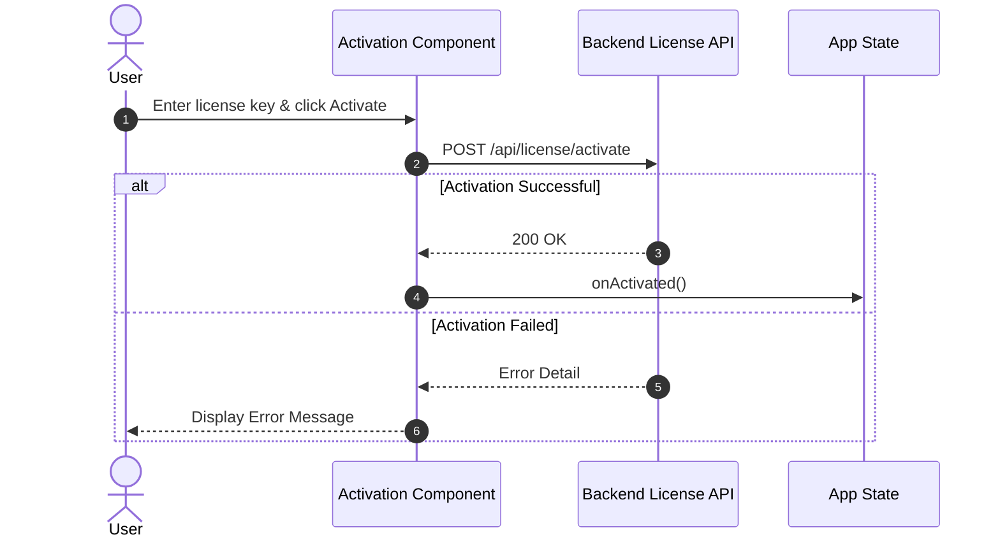

```mermaid
sequenceDiagram
  autonumber
  actor User
  participant UI as Activation Component
  participant API as Backend License API
  participant Parent as App State
  User->>UI: Enter license key & click Activate
  UI->>API: POST /api/license/activate
  alt Activation Successful
    API-->>UI: 200 OK
    UI->>Parent: onActivated()
  else Activation Failed
    API-->>UI: Error Detail
    UI-->>User: Display Error Message
  end
```
