# Activation Sequence

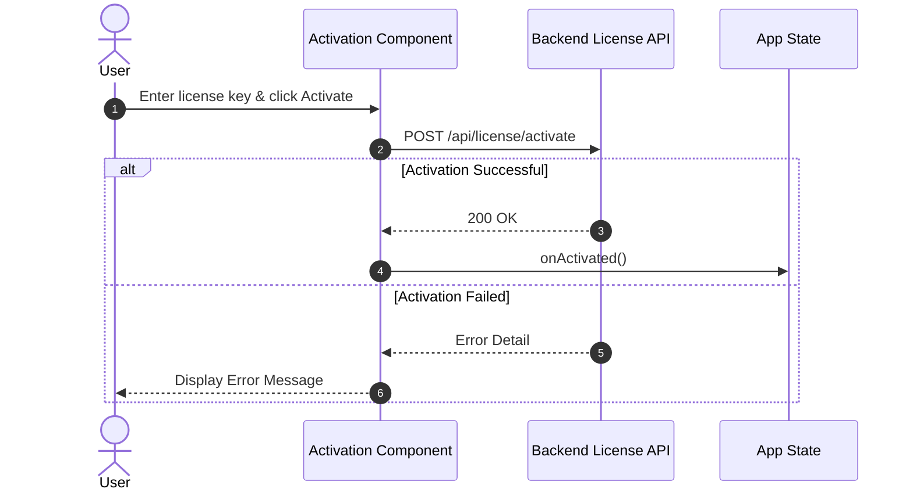
```mermaid
sequenceDiagram
  autonumber
  actor User
  participant UI as Activation Component
  participant API as Backend License API
  participant Parent as App State
  User->>UI: Enter license key & click Activate
  UI->>API: POST /api/license/activate
  alt Activation Successful
    API-->>UI: 200 OK
    UI->>Parent: onActivated()
  else Activation Failed
    API-->>UI: Error Detail
    UI-->>User: Display Error Message
  end
```

---

# App Initialization Flow

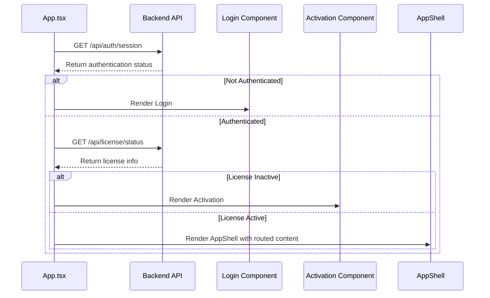
```mermaid
sequenceDiagram
    participant App as App.tsx
    participant API as Backend API
    participant Login as Login Component
    participant Act as Activation Component
    participant Shell as AppShell

    App->>API: GET /api/auth/session
    API-->>App: Return authentication status
    alt Not Authenticated
        App->>Login: Render Login
    else Authenticated
        App->>API: GET /api/license/status
        API-->>App: Return license info
        alt License Inactive
            App->>Act: Render Activation
        else License Active
            App->>Shell: Render AppShell with routed content
        end
    end
```

---

# Appshell Playback Sequence

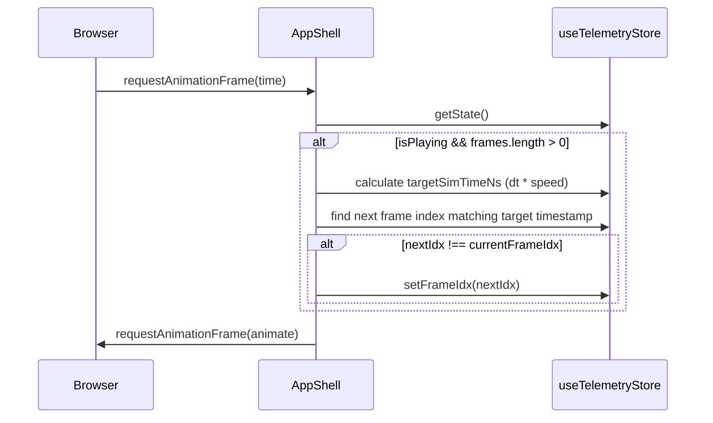
```mermaid
sequenceDiagram
  participant Browser
  participant AppShell
  participant Store as useTelemetryStore

  Browser->>AppShell: requestAnimationFrame(time)
  AppShell->>Store: getState()
  alt isPlaying && frames.length > 0
    AppShell->>Store: calculate targetSimTimeNs (dt * speed)
    AppShell->>Store: find next frame index matching target timestamp
    alt nextIdx !== currentFrameIdx
      AppShell->>Store: setFrameIdx(nextIdx)
    end
  end
  AppShell->>Browser: requestAnimationFrame(animate)
```

---

# Auth Manager Sequence

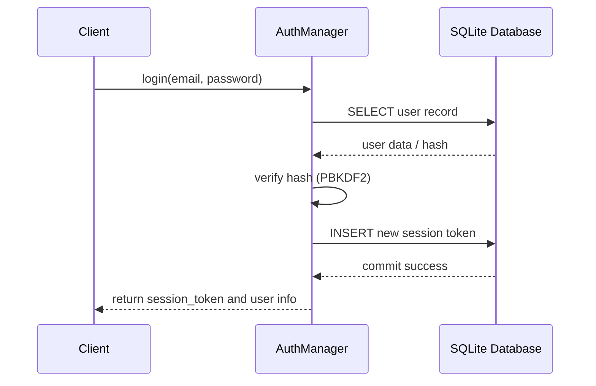
```mermaid
sequenceDiagram
    participant Client
    participant AuthManager
    participant DB as SQLite Database
    Client->>AuthManager: login(email, password)
    AuthManager->>DB: SELECT user record
    DB-->>AuthManager: user data / hash
    AuthManager->>AuthManager: verify hash (PBKDF2)
    AuthManager->>DB: INSERT new session token
    DB-->>AuthManager: commit success
    AuthManager-->>Client: return session_token and user info
```

---

# Backend Steamvr Sequence

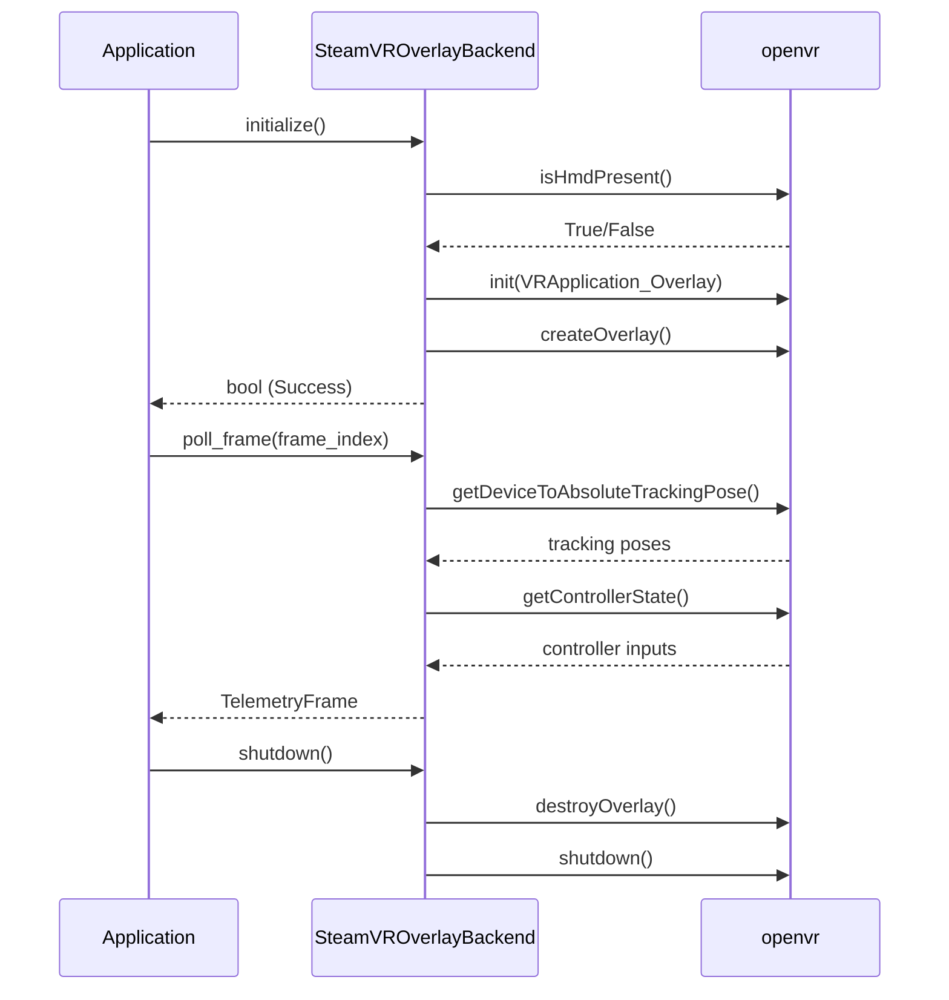
```mermaid
sequenceDiagram
    participant App as Application
    participant Backend as SteamVROverlayBackend
    participant OVR as openvr

    App->>Backend: initialize()
    Backend->>OVR: isHmdPresent()
    OVR-->>Backend: True/False
    Backend->>OVR: init(VRApplication_Overlay)
    Backend->>OVR: createOverlay()
    Backend-->>App: bool (Success)

    App->>Backend: poll_frame(frame_index)
    Backend->>OVR: getDeviceToAbsoluteTrackingPose()
    OVR-->>Backend: tracking poses
    Backend->>OVR: getControllerState()
    OVR-->>Backend: controller inputs
    Backend-->>App: TelemetryFrame

    App->>Backend: shutdown()
    Backend->>OVR: destroyOverlay()
    Backend->>OVR: shutdown()
```

---

# Biometric Synchronizer Sequence

```mermaid
sequenceDiagram
    participant HW as OpenXR Hardware Thread
    participant Sync as BiometricSynchronizer
    participant Loop as AsyncIO Loop
    participant Writer as AsyncParquetWriter

    HW->>Sync: push_frame(TelemetryFrame)
    Note over Sync: Appends to thread-safe deque
    Loop->>Sync: _consume_loop() runs periodically
    Sync->>Sync: Pop batch from deque
    Sync->>Writer: writer.push(frame_tuple)
```

---

# Bootstrap Admin Sequence

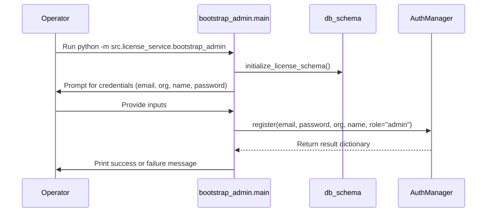
```mermaid
sequenceDiagram
    participant Operator
    participant Script as bootstrap_admin.main
    participant DB as db_schema
    participant Auth as AuthManager

    Operator->>Script: Run python -m src.license_service.bootstrap_admin
    Script->>DB: initialize_license_schema()
    Script->>Operator: Prompt for credentials (email, org, name, password)
    Operator->>Script: Provide inputs
    Script->>Auth: register(email, password, org, name, role="admin")
    Auth-->>Script: Return result dictionary
    Script->>Operator: Print success or failure message
```

---

# Data Synchronization Pipeline

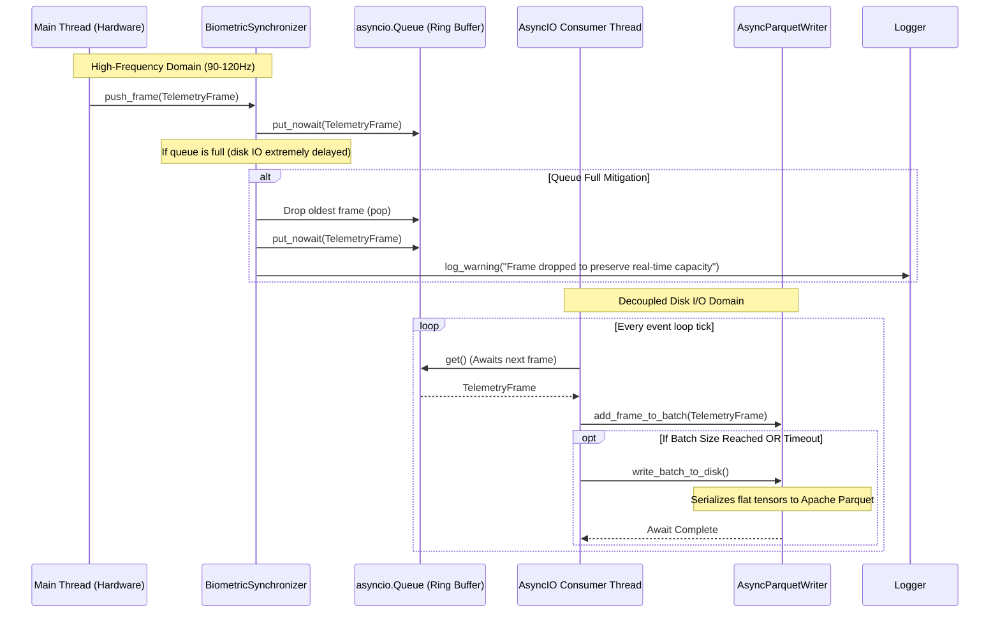
```mermaid
sequenceDiagram
    participant Main as Main Thread (Hardware)
    participant Sync as BiometricSynchronizer
    participant Queue as asyncio.Queue (Ring Buffer)
    participant Async as AsyncIO Consumer Thread
    participant Writer as AsyncParquetWriter

    note over Main, Sync: High-Frequency Domain (90-120Hz)
    Main->>Sync: push_frame(TelemetryFrame)
    Sync->>Queue: put_nowait(TelemetryFrame)
    
    note over Sync: If queue is full (disk IO extremely delayed)
    alt Queue Full Mitigation
        Sync->>Queue: Drop oldest frame (pop)
        Sync->>Queue: put_nowait(TelemetryFrame)
        Sync->>Logger: log_warning("Frame dropped to preserve real-time capacity")
    end
    
    note over Async, Writer: Decoupled Disk I/O Domain
    loop Every event loop tick
        Async->>Queue: get() (Awaits next frame)
        Queue-->>Async: TelemetryFrame
        Async->>Writer: add_frame_to_batch(TelemetryFrame)
        
        opt If Batch Size Reached OR Timeout
            Async->>Writer: write_batch_to_disk()
            note over Writer: Serializes flat tensors to Apache Parquet
            Writer-->>Async: Await Complete
        end
    end
```

---

# Discovery Sequence

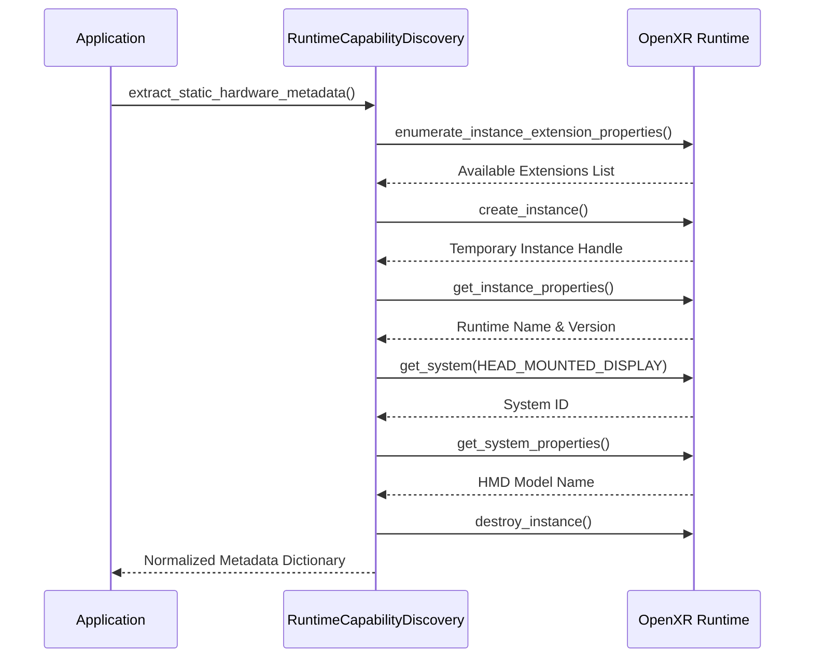
```mermaid
sequenceDiagram
    participant App as Application
    participant Disc as RuntimeCapabilityDiscovery
    participant XR as OpenXR Runtime

    App->>Disc: extract_static_hardware_metadata()
    Disc->>XR: enumerate_instance_extension_properties()
    XR-->>Disc: Available Extensions List
    Disc->>XR: create_instance()
    XR-->>Disc: Temporary Instance Handle
    Disc->>XR: get_instance_properties()
    XR-->>Disc: Runtime Name & Version
    Disc->>XR: get_system(HEAD_MOUNTED_DISPLAY)
    XR-->>Disc: System ID
    Disc->>XR: get_system_properties()
    XR-->>Disc: HMD Model Name
    Disc->>XR: destroy_instance()
    Disc-->>App: Normalized Metadata Dictionary
```

---

# Ext Eye Gaze Sequence

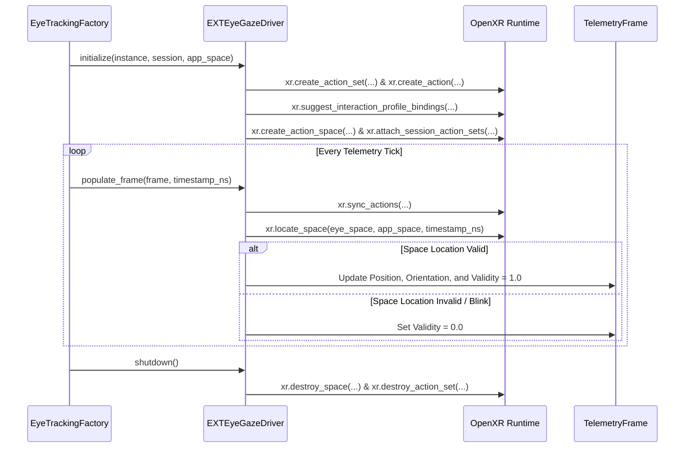
```mermaid
sequenceDiagram
    participant Factory as EyeTrackingFactory
    participant Driver as EXTEyeGazeDriver
    participant Runtime as OpenXR Runtime
    participant Frame as TelemetryFrame

    Factory->>Driver: initialize(instance, session, app_space)
    Driver->>Runtime: xr.create_action_set(...) & xr.create_action(...)
    Driver->>Runtime: xr.suggest_interaction_profile_bindings(...)
    Driver->>Runtime: xr.create_action_space(...) & xr.attach_session_action_sets(...)
    
    loop Every Telemetry Tick
        Factory->>Driver: populate_frame(frame, timestamp_ns)
        Driver->>Runtime: xr.sync_actions(...)
        Driver->>Runtime: xr.locate_space(eye_space, app_space, timestamp_ns)
        alt Space Location Valid
            Driver->>Frame: Update Position, Orientation, and Validity = 1.0
        else Space Location Invalid / Blink
            Driver->>Frame: Set Validity = 0.0
        end
    end

    Factory->>Driver: shutdown()
    Driver->>Runtime: xr.destroy_space(...) & xr.destroy_action_set(...)
```

---

# Eye Tracking Factory Sequence

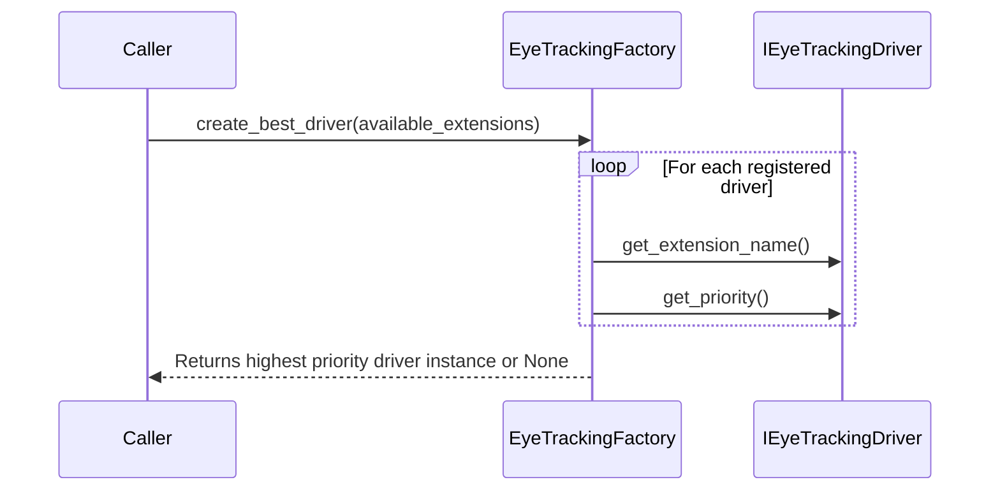
```mermaid
sequenceDiagram
    participant Caller
    participant Factory as EyeTrackingFactory
    participant Driver as IEyeTrackingDriver
    Caller->>Factory: create_best_driver(available_extensions)
    loop For each registered driver
        Factory->>Driver: get_extension_name()
        Factory->>Driver: get_priority()
    end
    Factory-->>Caller: Returns highest priority driver instance or None
```

---

# Fb Social Lifecycle

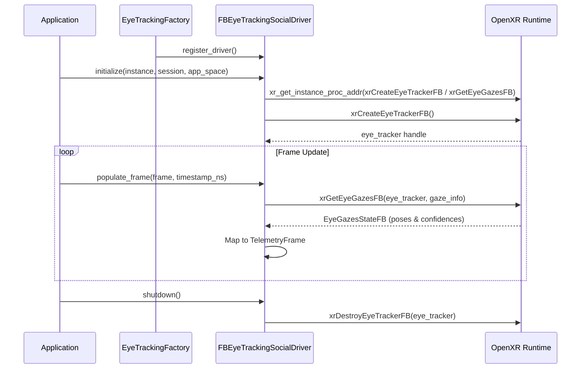
```mermaid
sequenceDiagram
    participant App as Application
    participant Factory as EyeTrackingFactory
    participant Driver as FBEyeTrackingSocialDriver
    participant XR as OpenXR Runtime

    Factory->>Driver: register_driver()
    App->>Driver: initialize(instance, session, app_space)
    Driver->>XR: xr_get_instance_proc_addr(xrCreateEyeTrackerFB / xrGetEyeGazesFB)
    Driver->>XR: xrCreateEyeTrackerFB()
    XR-->>Driver: eye_tracker handle
    
    loop Frame Update
        App->>Driver: populate_frame(frame, timestamp_ns)
        Driver->>XR: xrGetEyeGazesFB(eye_tracker, gaze_info)
        XR-->>Driver: EyeGazesStateFB (poses & confidences)
        Driver->>Driver: Map to TelemetryFrame
    end

    App->>Driver: shutdown()
    Driver->>XR: xrDestroyEyeTrackerFB(eye_tracker)
```

---

# Hardware Monitor Lifecycle

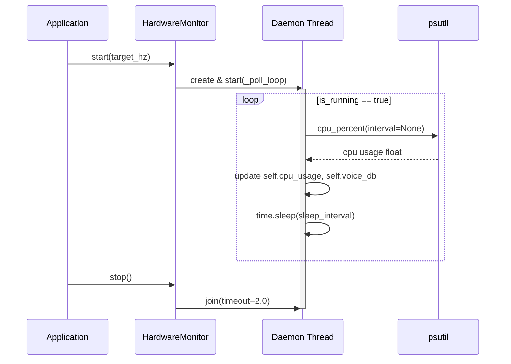
```mermaid
sequenceDiagram
    participant App as Application
    participant HM as HardwareMonitor
    participant Thread as Daemon Thread
    participant PS as psutil

    App->>HM: start(target_hz)
    HM->>Thread: create & start(_poll_loop)
    activate Thread
    loop is_running == true
        Thread->>PS: cpu_percent(interval=None)
        PS-->>Thread: cpu usage float
        Thread->>Thread: update self.cpu_usage, self.voice_db
        Thread->>Thread: time.sleep(sleep_interval)
    end
    App->>HM: stop()
    HM->>Thread: join(timeout=2.0)
    deactivate Thread
```

---

# Htc Tracker Sequence

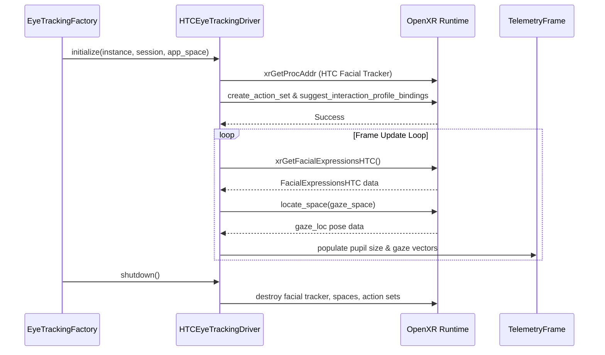
```mermaid
sequenceDiagram
    participant Factory as EyeTrackingFactory
    participant Driver as HTCEyeTrackingDriver
    participant OpenXR as OpenXR Runtime
    participant Frame as TelemetryFrame

    Factory->>Driver: initialize(instance, session, app_space)
    Driver->>OpenXR: xrGetProcAddr (HTC Facial Tracker)
    Driver->>OpenXR: create_action_set & suggest_interaction_profile_bindings
    OpenXR-->>Driver: Success

    loop Frame Update Loop
        Driver->>OpenXR: xrGetFacialExpressionsHTC()
        OpenXR-->>Driver: FacialExpressionsHTC data
        Driver->>OpenXR: locate_space(gaze_space)
        OpenXR-->>Driver: gaze_loc pose data
        Driver->>Frame: populate pupil size & gaze vectors
    end

    Factory->>Driver: shutdown()
    Driver->>OpenXR: destroy facial tracker, spaces, action sets
```

---

# License Manager Activation Sequence

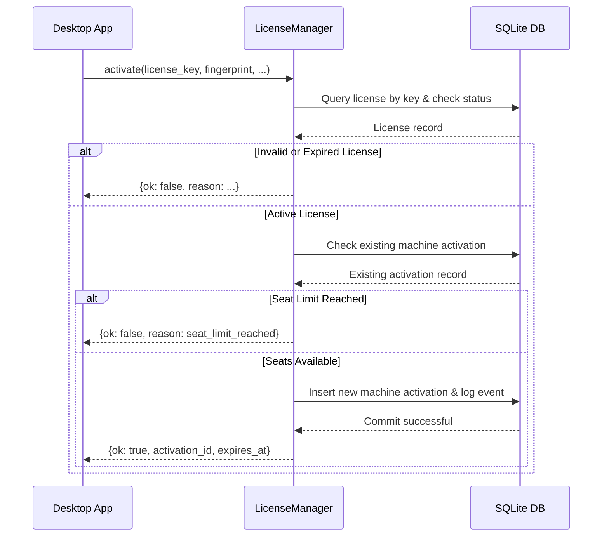
```mermaid
sequenceDiagram
    participant Client as Desktop App
    participant LM as LicenseManager
    participant DB as SQLite DB

    Client->>LM: activate(license_key, fingerprint, ...)
    LM->>DB: Query license by key & check status
    DB-->>LM: License record
    alt Invalid or Expired License
        LM-->>Client: {ok: false, reason: ...}
    else Active License
        LM->>DB: Check existing machine activation
        DB-->>LM: Existing activation record
        alt Seat Limit Reached
            LM-->>Client: {ok: false, reason: seat_limit_reached}
        else Seats Available
            LM->>DB: Insert new machine activation & log event
            DB-->>LM: Commit successful
            LM-->>Client: {ok: true, activation_id, expires_at}
        end
    end
```

---

# Login Sequence

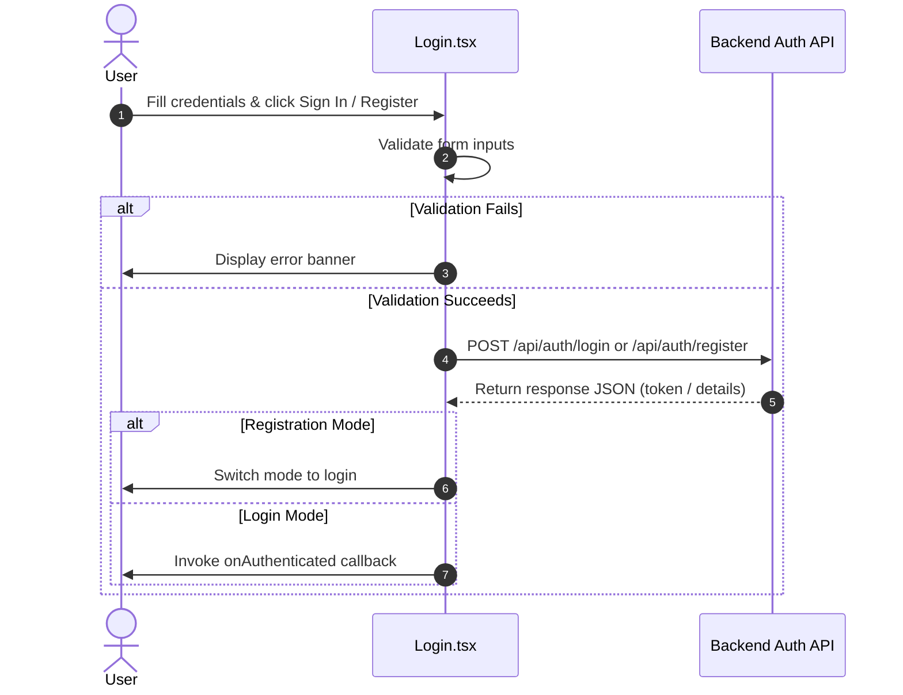
```mermaid
sequenceDiagram
  autonumber
  actor User
  participant Login as Login.tsx
  participant Backend as Backend Auth API
  User->>Login: Fill credentials & click Sign In / Register
  Login->>Login: Validate form inputs
  alt Validation Fails
    Login->>User: Display error banner
  else Validation Succeeds
    Login->>Backend: POST /api/auth/login or /api/auth/register
    Backend-->>Login: Return response JSON (token / details)
    alt Registration Mode
      Login->>User: Switch mode to login
    else Login Mode
      Login->>User: Invoke onAuthenticated callback
    end
  end
```

---

# New Session Lifecycle

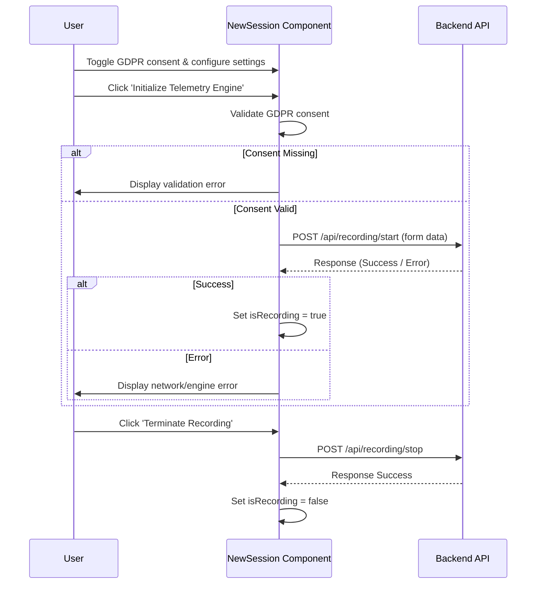
```mermaid
sequenceDiagram
    participant User
    participant UI as NewSession Component
    participant API as Backend API

    User->>UI: Toggle GDPR consent & configure settings
    User->>UI: Click 'Initialize Telemetry Engine'
    UI->>UI: Validate GDPR consent
    alt Consent Missing
        UI->>User: Display validation error
    else Consent Valid
        UI->>API: POST /api/recording/start (form data)
        API-->>UI: Response (Success / Error)
        alt Success
            UI->>UI: Set isRecording = true
        else Error
            UI->>User: Display network/engine error
        end
    end

    User->>UI: Click 'Terminate Recording'
    UI->>API: POST /api/recording/stop
    API-->>UI: Response Success
    UI->>UI: Set isRecording = false
```

---

# Oculus Backend Sequence

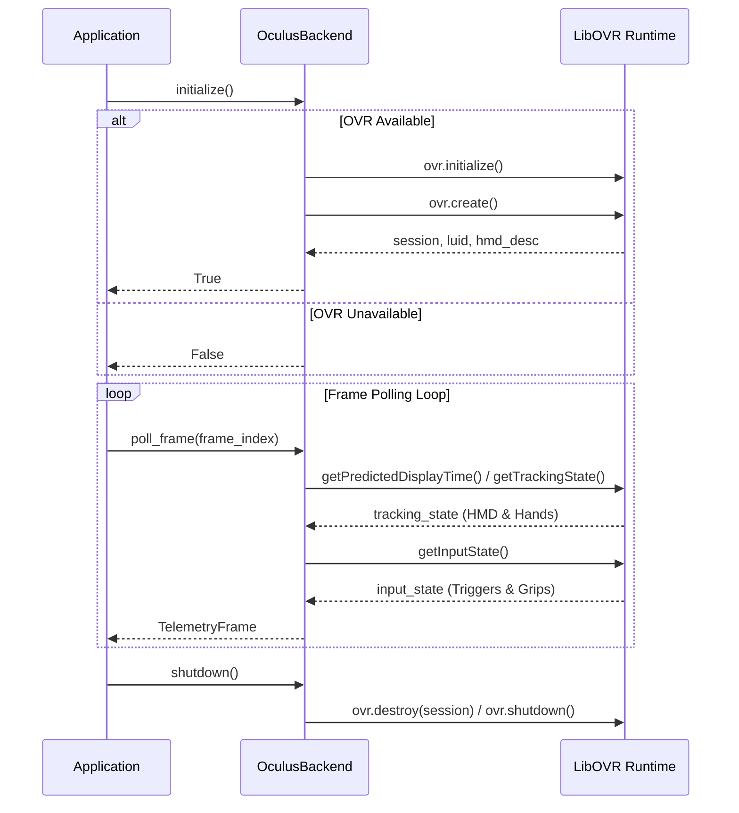
```mermaid
sequenceDiagram
    participant App as Application
    participant Backend as OculusBackend
    participant OVR as LibOVR Runtime

    App->>Backend: initialize()
    alt OVR Available
        Backend->>OVR: ovr.initialize()
        Backend->>OVR: ovr.create()
        OVR-->>Backend: session, luid, hmd_desc
        Backend-->>App: True
    else OVR Unavailable
        Backend-->>App: False
    end

    loop Frame Polling Loop
        App->>Backend: poll_frame(frame_index)
        Backend->>OVR: getPredictedDisplayTime() / getTrackingState()
        OVR-->>Backend: tracking_state (HMD & Hands)
        Backend->>OVR: getInputState()
        OVR-->>Backend: input_state (Triggers & Grips)
        Backend-->>App: TelemetryFrame
    end

    App->>Backend: shutdown()
    Backend->>OVR: ovr.destroy(session) / ovr.shutdown()
```

---

# Openxr Backend Lifecycle

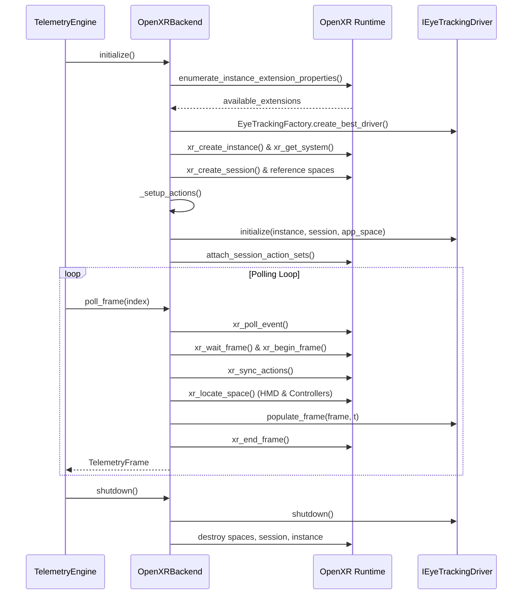
```mermaid
sequenceDiagram
    participant App as TelemetryEngine
    participant Backend as OpenXRBackend
    participant XR as OpenXR Runtime
    participant Eye as IEyeTrackingDriver

    App->>Backend: initialize()
    Backend->>XR: enumerate_instance_extension_properties()
    XR-->>Backend: available_extensions
    Backend->>Eye: EyeTrackingFactory.create_best_driver()
    Backend->>XR: xr_create_instance() & xr_get_system()
    Backend->>XR: xr_create_session() & reference spaces
    Backend->>Backend: _setup_actions()
    Backend->>Eye: initialize(instance, session, app_space)
    Backend->>XR: attach_session_action_sets()
    
    loop Polling Loop
        App->>Backend: poll_frame(index)
        Backend->>XR: xr_poll_event()
        Backend->>XR: xr_wait_frame() & xr_begin_frame()
        Backend->>XR: xr_sync_actions()
        Backend->>XR: xr_locate_space() (HMD & Controllers)
        Backend->>Eye: populate_frame(frame, t)
        Backend->>XR: xr_end_frame()
        Backend-->>App: TelemetryFrame
    end

    App->>Backend: shutdown()
    Backend->>Eye: shutdown()
    Backend->>XR: destroy spaces, session, instance
```

---

# Openxr Backend Sequence

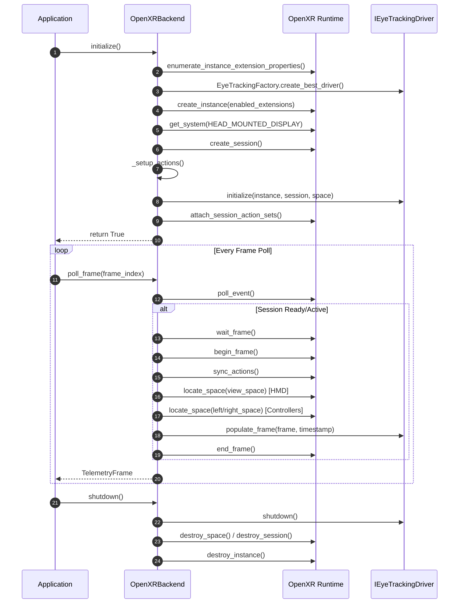
```mermaid
sequenceDiagram
    autonumber
    participant Application
    participant Backend as OpenXRBackend
    participant Runtime as OpenXR Runtime
    participant EyeDriver as IEyeTrackingDriver

    Application->>Backend: initialize()
    Backend->>Runtime: enumerate_instance_extension_properties()
    Backend->>EyeDriver: EyeTrackingFactory.create_best_driver()
    Backend->>Runtime: create_instance(enabled_extensions)
    Backend->>Runtime: get_system(HEAD_MOUNTED_DISPLAY)
    Backend->>Runtime: create_session()
    Backend->>Backend: _setup_actions()
    Backend->>EyeDriver: initialize(instance, session, space)
    Backend->>Runtime: attach_session_action_sets()
    Backend-->>Application: return True

    loop Every Frame Poll
        Application->>Backend: poll_frame(frame_index)
        Backend->>Runtime: poll_event()
        alt Session Ready/Active
            Backend->>Runtime: wait_frame()
            Backend->>Runtime: begin_frame()
            Backend->>Runtime: sync_actions()
            Backend->>Runtime: locate_space(view_space) [HMD]
            Backend->>Runtime: locate_space(left/right_space) [Controllers]
            Backend->>EyeDriver: populate_frame(frame, timestamp)
            Backend->>Runtime: end_frame()
        end
        Backend-->>Application: TelemetryFrame
    end

    Application->>Backend: shutdown()
    Backend->>EyeDriver: shutdown()
    Backend->>Runtime: destroy_space() / destroy_session()
    Backend->>Runtime: destroy_instance()
```

---

# Openxr Headless Lifecycle

```mermaid
sequenceDiagram
    participant App as Application
    participant Backend as OpenXRHeadlessBackend
    participant XR as OpenXR Runtime
    participant Eye as IEyeTrackingDriver

    App->>Backend: initialize()
    Backend->>XR: Enumerate extensions
    alt XR_MND_headless available
        Backend->>XR: Create instance (pure headless)
    else Fallback required
        Backend->>Backend: _create_d3d11_binding()
        Backend->>XR: Create instance with D3D11 extension
    end
    Backend->>Eye: create_best_driver() & initialize()
    Backend->>XR: create_session() & attach_session_action_sets()
    Backend-->>App: Return True

    loop Frame Polling
        App->>Backend: poll_frame(frame_index)
        Backend->>XR: poll_event() / wait_frame() / begin_frame()
        Backend->>XR: sync_actions() / locate_views() / locate_space()
        Backend->>Eye: populate_frame(frame, time)
        Backend->>XR: end_frame()
        Backend-->>App: TelemetryFrame
    end

    App->>Backend: shutdown()
    Backend->>Eye: shutdown()
    Backend->>XR: Destroy spaces, actions, session, instance
```

---

# Openxr Headless Sequence

```mermaid
sequenceDiagram
    autonumber
    participant Client
    participant Backend as OpenXRHeadlessBackend
    participant EyeDriver as IEyeTrackingDriver
    participant D3D as D3D11 (ctypes)
    participant OpenXR as OpenXR Runtime

    Client->>Backend: initialize()
    Backend->>OpenXR: enumerate_instance_extension_properties()
    alt XR_MND_headless present
        Backend->>Backend: Enable pure headless mode
    else XR_KHR_D3D11_enable present (Windows)
        Backend->>D3D: D3D11CreateDevice()
        D3D-->>Backend: d3d_device, d3d_context
        Backend->>OpenXR: GraphicsBindingD3D11KHR
    end
    Backend->>EyeDriver: EyeTrackingFactory.create_best_driver()
    Backend->>OpenXR: create_instance & get_system
    Backend->>OpenXR: create_session & create_reference_space
    Backend->>Backend: _setup_actions()
    Backend->>EyeDriver: initialize(instance, session, app_space)
    Backend->>OpenXR: attach_session_action_sets()
    Backend-->>Client: True

    Client->>Backend: poll_frame(frame_index)
    Backend->>OpenXR: poll_event()
    Note over Backend,OpenXR: Pump session state events (READY / STOPPING)
    Backend->>OpenXR: wait_frame() & begin_frame()
    Backend->>OpenXR: sync_actions()
    Backend->>OpenXR: locate_views() (HMD Pose)
    Backend->>OpenXR: locate_space() (Controller Poses)
    Backend->>OpenXR: get_action_state_float() (Triggers)
    Backend->>EyeDriver: populate_frame(frame, display_time)
    Backend->>OpenXR: end_frame()
    Backend-->>Client: TelemetryFrame
```

---

# Openxr Runtime Discovery Sequence

```mermaid
sequenceDiagram
    autonumber
    participant Client as Caller / Application
    participant RCD as RuntimeCapabilityDiscovery
    participant XR as OpenXR API
    participant Runtime as Active OpenXR Runtime

    Client->>RCD: extract_static_hardware_metadata()
    activate RCD
    RCD->>XR: enumerate_instance_extension_properties()
    XR-->>RCD: available_extensions list
    RCD->>RCD: Evaluate biometric tracking support
    
    rect rgb(240, 240, 240)
        note over RCD, Runtime: Temporary Instance Lifecycle
        RCD->>XR: create_instance(InstanceCreateInfo("VRTelemetry_Prober"))
        XR->>Runtime: Initialize transient instance
        Runtime-->>XR: temp_instance handle
        XR-->>RCD: temp_instance

        RCD->>XR: get_instance_properties(temp_instance)
        XR->>Runtime: Query runtime details
        Runtime-->>XR: InstanceProperties (runtime_name, runtime_version)
        XR-->>RCD: InstanceProperties

        RCD->>XR: get_system(temp_instance, FormFactor.HEAD_MOUNTED_DISPLAY)
        XR->>Runtime: Resolve system ID
        Runtime-->>XR: sys_id
        XR-->>RCD: sys_id

        RCD->>XR: get_system_properties(temp_instance, sys_id)
        XR->>Runtime: Query hardware properties
        Runtime-->>XR: SystemProperties (system_name)
        XR-->>RCD: SystemProperties

        RCD->>XR: destroy_instance(temp_instance)
        XR->>Runtime: Release transient instance
    end

    RCD-->>Client: Metadata dictionary
    deactivate RCD
```

---

# Server Boot Sequence

```mermaid
sequenceDiagram
    participant Electron as Electron Frontend
    participant Entry as server_entrypoint.py
    participant Log as setup_logging()
    participant Uvicorn as uvicorn.run
    participant App as FastAPI App

    Note over Entry: Execution starts (__main__)
    Entry->>Log: setup_logging()
    Log-->>Entry: Logging configured
    Entry->>Uvicorn: uvicorn.run(app, host="127.0.0.1", port=8000)
    Uvicorn->>App: Starts FastAPI server context
    Electron->>App: HTTP Requests (Telemetry API)
```

---

# Server Entrypoint Sequence

```mermaid
sequenceDiagram
    autonumber
    actor DesktopShell as Desktop Shell / Electron
    participant Entrypoint as server_entrypoint.py
    participant Logger as src.utils.logger
    participant Uvicorn as uvicorn
    participant FastAPI as src.main:app

    DesktopShell->>Entrypoint: Launch python server_entrypoint.py
    Entrypoint->>Logger: setup_logging()
    Entrypoint->>Logger: logger.info("Bootstrapping...")
    Entrypoint->>Uvicorn: run(app, host="127.0.0.1", port=8000)
    activate Uvicorn
    Uvicorn->>FastAPI: Initialize ASGI Application
    Uvicorn-->>DesktopShell: Ready on http://127.0.0.1:8000
    DesktopShell->>Uvicorn: HTTP Requests
    Uvicorn->>FastAPI: Route Request Handlers
    deactivate Uvicorn
```

---

# Session Uploader Sequence

```mermaid
sequenceDiagram
    participant App as Application
    participant SU as SessionUploader
    participant LLC as LocalLicenseCache
    participant CS as CentralServer

    App->>SU: upload(parquet_path, session_id, metadata)
    SU->>LLC: get_state()
    alt License Inactive or Missing
        SU->>LLC: queue_pending_upload()
        SU-->>App: Return {ok: false, reason}
    else License Active
        SU->>CS: POST /data/upload-session
        alt Upload Successful (200 OK)
            SU->>LLC: clear_pending_upload(session_id)
            SU-->>App: Return response.json()
        else Upload Fails / Network Error
            SU->>LLC: queue_pending_upload() & record failure
            SU-->>App: Return {ok: false, reason}
        end
    end
```

---

# Startup And Acquisition Loop

```mermaid
sequenceDiagram
    participant CLI as main.py
    participant Engine as TelemetryEngine
    participant DB as DatabaseManager
    participant XR as OpenXRHeadlessBackend
    participant Sync as BiometricSynchronizer
    participant Disk as AsyncParquetWriter
    participant HW as Hardware

    CLI->>CLI: parse_arguments()
    CLI->>CLI: Check --gdpr-consent
    alt No Consent
        CLI-->>User: GDPRConsentError (Abort)
    end

    CLI->>Hardware: extract_static_hardware_metadata()
    Hardware-->>CLI: Hardware topology dict
    
    CLI->>Engine: __init__(output_dir, gdpr_consent, metadata)
    Engine->>Engine: Generate session_id
    Engine->>DB: Instantiate
    Engine->>XR: Instantiate
    Engine->>Disk: Instantiate(AsyncParquetWriter)
    Engine->>Sync: Instantiate(writer, hardware_monitor)
    
    CLI->>Engine: start()
    Engine->>XR: initialize()
    XR-->>Engine: True (Bound successfully)
    
    Engine->>DB: persist_experiment(subject_metadata)
    
    Engine->>Disk: start()
    Engine->>Engine: Spin up AsyncConsumerThread
    note right of Engine: Async thread runs BiometricSynchronizer event loop
    
    loop Real-time Polling (e.g., 90Hz-120Hz)
        Engine->>XR: poll_frame(frames_recorded)
        note over XR: Blocks on xrWaitFrame (Hardware Pacing)
        XR-->>Engine: TelemetryFrame (Flat Tensor)
        Engine->>Engine: Inject contextual marker (scene_id)
        Engine->>Sync: push_frame(frame_data)
        note over Sync: Pushes to non-blocking ring buffer
    end
    
    note over Engine: On Shutdown (KeyboardInterrupt)
    Engine->>Engine: _teardown()
    Engine->>Sync: stop()
    Engine->>Disk: stop()
    Engine->>XR: shutdown()
```

---

# Steamvr Backend Sequence

```mermaid
sequenceDiagram
    autonumber
    participant App as Application / Loop
    participant Backend as SteamVROverlayBackend
    participant OpenVR as OpenVR Runtime
    participant TF as TelemetryFrame

    rect rgb(230, 240, 250)
        note over App, OpenVR: Initialization Context
        App->>Backend: initialize()
        Backend->>OpenVR: isHmdPresent()
        alt HMD Detected
            Backend->>OpenVR: init(VRApplication_Overlay)
            Backend->>OpenVR: IVROverlay().createOverlay(...)
            Backend->>OpenVR: hideOverlay(handle)
            Backend-->>App: return True
        else Not Present / Exception
            Backend-->>App: return False
        end
    end

    rect rgb(240, 250, 230)
        note over App, TF: Frame Polling Cycle
        App->>Backend: poll_frame(frame_index)
        Backend->>TF: create_empty(frame_index)
        Backend->>OpenVR: getDeviceToAbsoluteTrackingPose(...)
        
        opt HMD Pose Valid
            Backend->>Backend: matrix_to_quaternion(m)
            Backend->>TF: Populate HMD Pose & Validity
        end

        opt Controllers Valid
            Backend->>OpenVR: getControllerState(left_idx)
            Backend->>OpenVR: getControllerState(right_idx)
            Backend->>Backend: matrix_to_quaternion(m)
            Backend->>TF: Populate Left/Right Pose, Joystick, Trigger, Grip
        end

        Backend->>OpenVR: getBoolTrackedDeviceProperty(Prop_HasCamera_Bool)
        Backend->>TF: Update timestamp_ns & eye_tracking_valid
        Backend-->>App: return TelemetryFrame
    end

    rect rgb(250, 230, 230)
        note over App, OpenVR: Shutdown Context
        App->>Backend: shutdown()
        Backend->>OpenVR: destroyOverlay(handle)
        Backend->>OpenVR: shutdown()
        Backend-->>App: Closed
    end
```

---

# Telemetry Engine Lifecycle

```mermaid
sequenceDiagram
    participant User
    participant Engine as TelemetryEngine
    participant Backend as VR Backend / UDP
    participant Sync as BiometricSynchronizer
    participant Writer as AsyncParquetWriter
    participant Uploader as SessionUploader

    User->>Engine: start()
    Engine->>Engine: Validate GDPR Consent
    Engine->>Sync: start()
    Engine->>Writer: start()
    Engine->>Backend: initialize() / connect()
    
    loop Telemetry Active Loop
        Backend->>Engine: poll_frame() / stream data
        Engine->>Sync: push_frame()
        Sync->>Writer: batch & write parquet
    end

    User->>Engine: Interruption / Stop
    Engine->>Sync: stop()
    Engine->>Backend: shutdown()
    Engine->>Writer: stop()
    Engine->>Uploader: upload(parquet_path, session_id)
    Uploader-->>Engine: upload result
    Engine->>User: Shutdown complete
```

---

# Tert Runner Boot

```mermaid
sequenceDiagram
    autonumber
    participant Main as __main__
    participant Runner as tert_runner
    participant Logger as logger
    participant Installer as auto_installer
    participant Pipeline as main_pipeline

    Main->>Runner: boot_framework_context()
    Runner->>Logger: setup_logging()
    Runner->>Installer: verify_and_install_dependencies()
    Installer-->>Runner: Dependencies Verified
    Runner->>Logger: info("Bootstrapping complete...")
    Runner->>Pipeline: execute_pipeline()
```

---

# Tert Runner Boot Sequence

```mermaid
sequenceDiagram
    autonumber
    actor User
    participant Runner as tert_runner.py
    participant Logger as src.utils.logger
    participant Installer as src.utils.auto_installer
    participant Main as src.main

    User->>Runner: Execute script (__main__)
    Runner->>Runner: boot_framework_context()
    Runner->>Logger: setup_logging()
    Logger-->>Runner: Logging Context Ready
    Runner->>Installer: verify_and_install_dependencies()
    Installer-->>Runner: Dependencies Verified
    Runner->>Logger: logger.info("Bootstrapping complete...")
    Runner->>Main: execute_pipeline()
    Main-->>Runner: Execution Completed
```

---

# Tert Runner Sequence

```mermaid
sequenceDiagram
    autonumber
    participant Main as __main__
    participant Runner as tert_runner.py
    participant Logger as setup_logging()
    participant Installer as verify_and_install_dependencies()
    participant Pipeline as execute_pipeline()

    Main->>Runner: boot_framework_context()
    Runner->>Logger: Initialize logging
    Runner->>Installer: Verify and install dependencies
    Installer-->>Runner: Dependencies ready
    Runner->>Logger: Log bootstrap complete
    Runner->>Pipeline: execute_pipeline()
```

---

# Udp Receiver Sequence

```mermaid
sequenceDiagram
    participant Quest as Quest Pro Native Overlay
    participant Protocol as NativeQuestHarvesterProtocol
    participant Sync as BiometricSynchronizer
    
    Quest->>Protocol: Send 64-byte binary datagram
    Note over Protocol: Validate size & unpack binary struct
    Protocol->>Protocol: Map fields to TelemetryFrame
    Protocol->>Sync: push_frame(frame)
```

---
