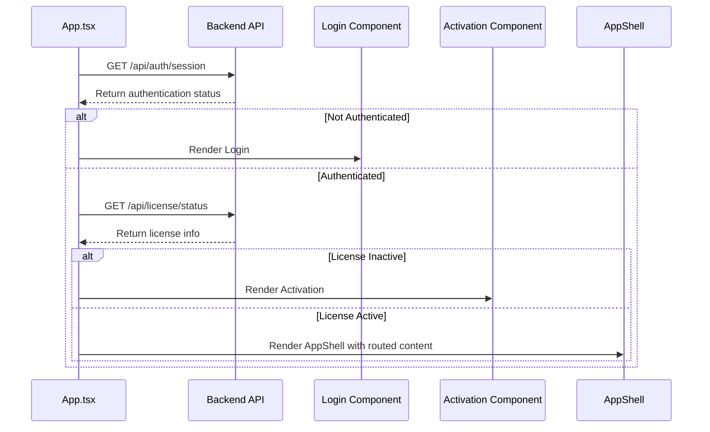

```mermaid
sequenceDiagram
    participant App as App.tsx
    participant API as Backend API
    participant Login as Login Component
    participant Act as Activation Component
    participant Shell as AppShell

    App->>API: GET /api/auth/session
    API-->>App: Return authentication status
    alt Not Authenticated
        App->>Login: Render Login
    else Authenticated
        App->>API: GET /api/license/status
        API-->>App: Return license info
        alt License Inactive
            App->>Act: Render Activation
        else License Active
            App->>Shell: Render AppShell with routed content
        end
    end
```
