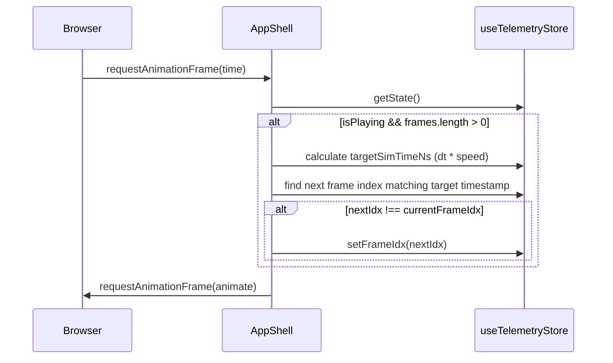

```mermaid
sequenceDiagram
  participant Browser
  participant AppShell
  participant Store as useTelemetryStore

  Browser->>AppShell: requestAnimationFrame(time)
  AppShell->>Store: getState()
  alt isPlaying && frames.length > 0
    AppShell->>Store: calculate targetSimTimeNs (dt * speed)
    AppShell->>Store: find next frame index matching target timestamp
    alt nextIdx !== currentFrameIdx
      AppShell->>Store: setFrameIdx(nextIdx)
    end
  end
  AppShell->>Browser: requestAnimationFrame(animate)
```
