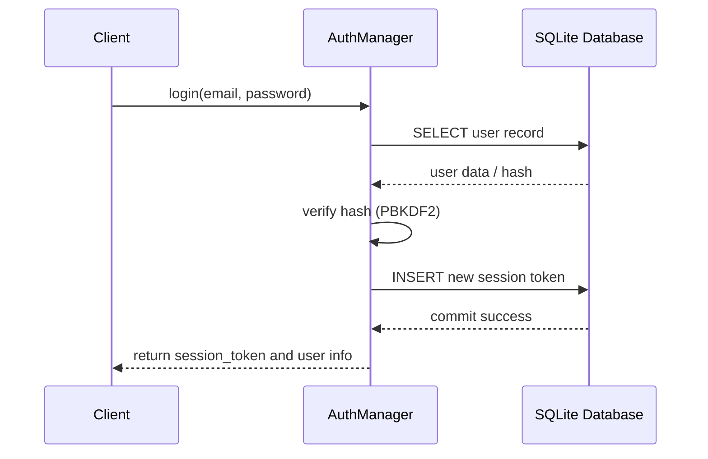

```mermaid
sequenceDiagram
    participant Client
    participant AuthManager
    participant DB as SQLite Database
    Client->>AuthManager: login(email, password)
    AuthManager->>DB: SELECT user record
    DB-->>AuthManager: user data / hash
    AuthManager->>AuthManager: verify hash (PBKDF2)
    AuthManager->>DB: INSERT new session token
    DB-->>AuthManager: commit success
    AuthManager-->>Client: return session_token and user info
```
