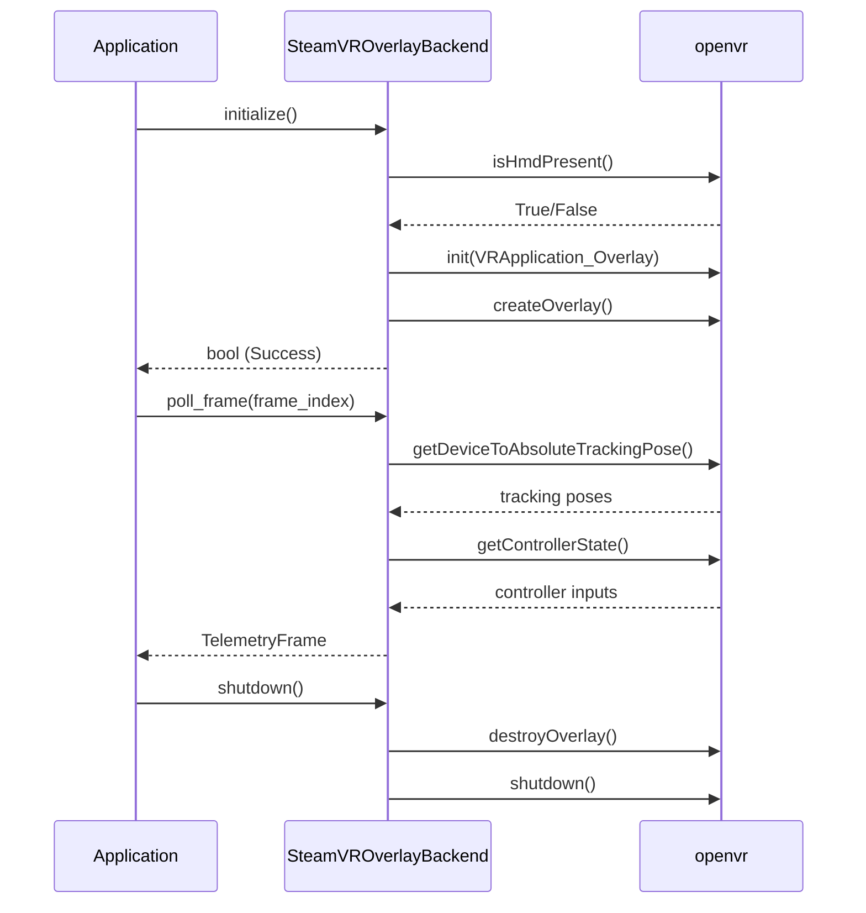

```mermaid
sequenceDiagram
    participant App as Application
    participant Backend as SteamVROverlayBackend
    participant OVR as openvr

    App->>Backend: initialize()
    Backend->>OVR: isHmdPresent()
    OVR-->>Backend: True/False
    Backend->>OVR: init(VRApplication_Overlay)
    Backend->>OVR: createOverlay()
    Backend-->>App: bool (Success)

    App->>Backend: poll_frame(frame_index)
    Backend->>OVR: getDeviceToAbsoluteTrackingPose()
    OVR-->>Backend: tracking poses
    Backend->>OVR: getControllerState()
    OVR-->>Backend: controller inputs
    Backend-->>App: TelemetryFrame

    App->>Backend: shutdown()
    Backend->>OVR: destroyOverlay()
    Backend->>OVR: shutdown()
```
