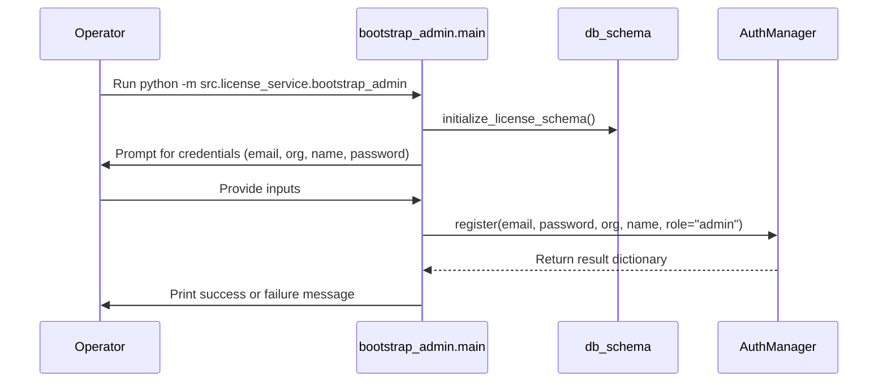

```mermaid
sequenceDiagram
    participant Operator
    participant Script as bootstrap_admin.main
    participant DB as db_schema
    participant Auth as AuthManager

    Operator->>Script: Run python -m src.license_service.bootstrap_admin
    Script->>DB: initialize_license_schema()
    Script->>Operator: Prompt for credentials (email, org, name, password)
    Operator->>Script: Provide inputs
    Script->>Auth: register(email, password, org, name, role="admin")
    Auth-->>Script: Return result dictionary
    Script->>Operator: Print success or failure message
```
