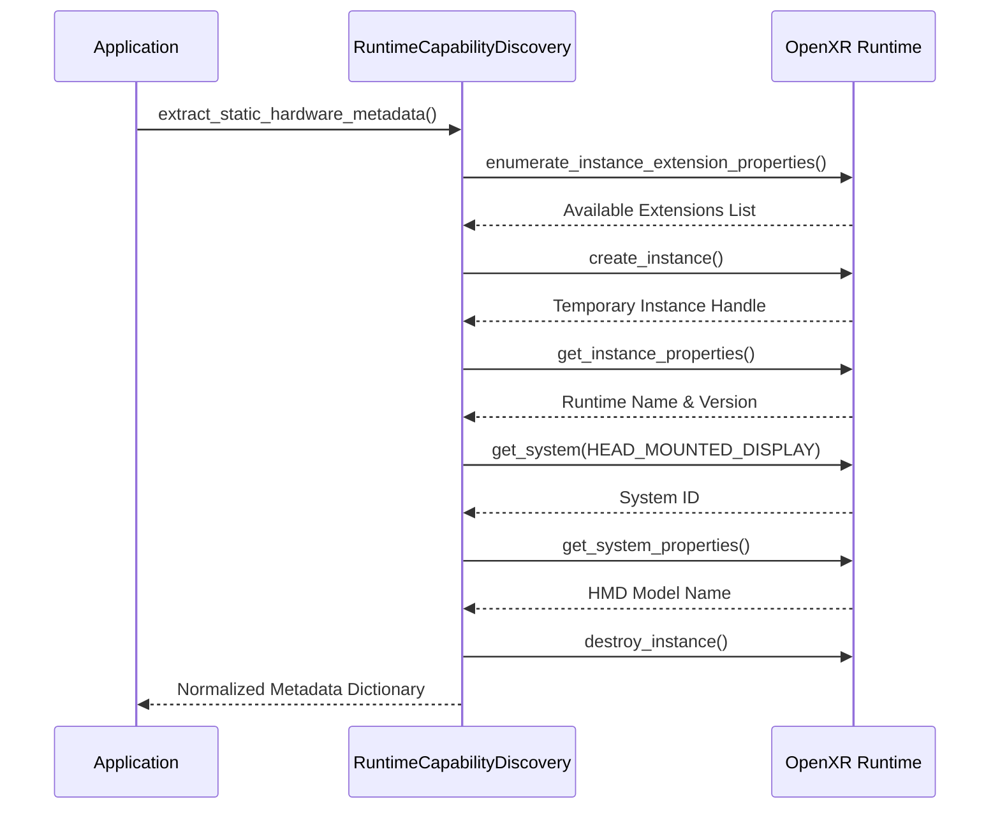

```mermaid
sequenceDiagram
    participant App as Application
    participant Disc as RuntimeCapabilityDiscovery
    participant XR as OpenXR Runtime

    App->>Disc: extract_static_hardware_metadata()
    Disc->>XR: enumerate_instance_extension_properties()
    XR-->>Disc: Available Extensions List
    Disc->>XR: create_instance()
    XR-->>Disc: Temporary Instance Handle
    Disc->>XR: get_instance_properties()
    XR-->>Disc: Runtime Name & Version
    Disc->>XR: get_system(HEAD_MOUNTED_DISPLAY)
    XR-->>Disc: System ID
    Disc->>XR: get_system_properties()
    XR-->>Disc: HMD Model Name
    Disc->>XR: destroy_instance()
    Disc-->>App: Normalized Metadata Dictionary
```
