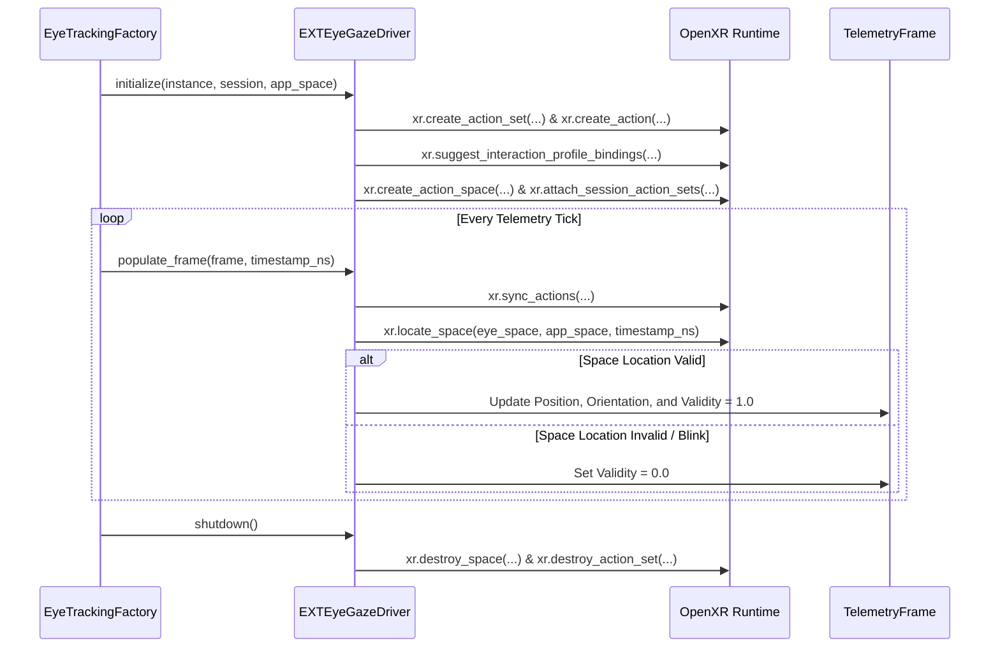

```mermaid
sequenceDiagram
    participant Factory as EyeTrackingFactory
    participant Driver as EXTEyeGazeDriver
    participant Runtime as OpenXR Runtime
    participant Frame as TelemetryFrame

    Factory->>Driver: initialize(instance, session, app_space)
    Driver->>Runtime: xr.create_action_set(...) & xr.create_action(...)
    Driver->>Runtime: xr.suggest_interaction_profile_bindings(...)
    Driver->>Runtime: xr.create_action_space(...) & xr.attach_session_action_sets(...)
    
    loop Every Telemetry Tick
        Factory->>Driver: populate_frame(frame, timestamp_ns)
        Driver->>Runtime: xr.sync_actions(...)
        Driver->>Runtime: xr.locate_space(eye_space, app_space, timestamp_ns)
        alt Space Location Valid
            Driver->>Frame: Update Position, Orientation, and Validity = 1.0
        else Space Location Invalid / Blink
            Driver->>Frame: Set Validity = 0.0
        end
    end

    Factory->>Driver: shutdown()
    Driver->>Runtime: xr.destroy_space(...) & xr.destroy_action_set(...)
```
