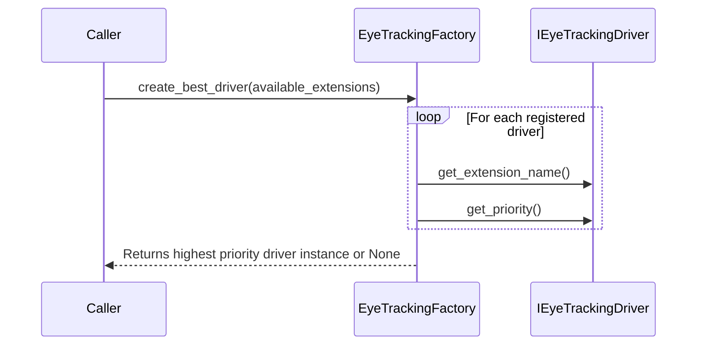

```mermaid
sequenceDiagram
    participant Caller
    participant Factory as EyeTrackingFactory
    participant Driver as IEyeTrackingDriver
    Caller->>Factory: create_best_driver(available_extensions)
    loop For each registered driver
        Factory->>Driver: get_extension_name()
        Factory->>Driver: get_priority()
    end
    Factory-->>Caller: Returns highest priority driver instance or None
```
