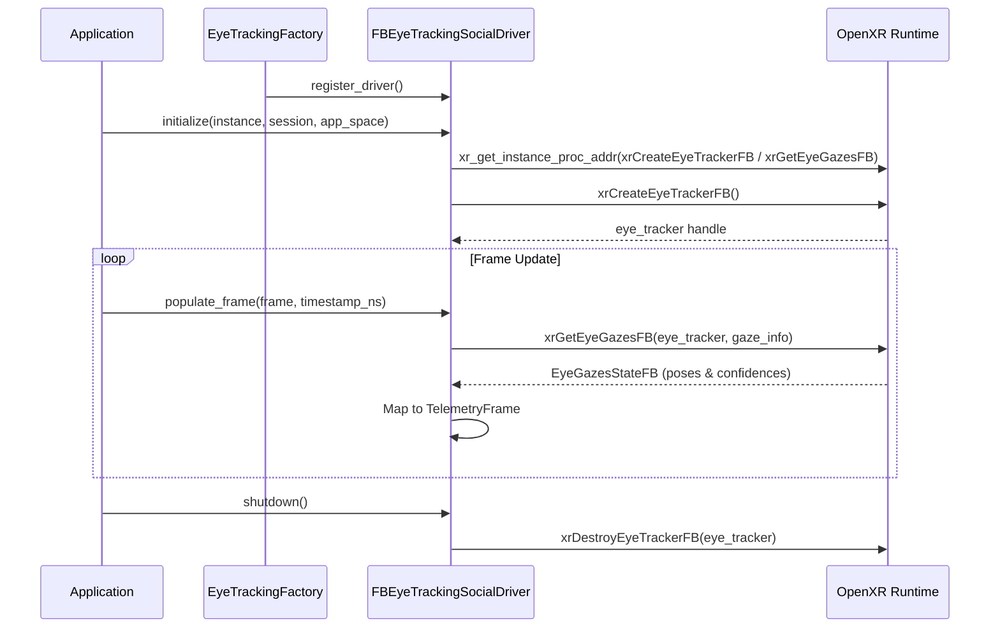

```mermaid
sequenceDiagram
    participant App as Application
    participant Factory as EyeTrackingFactory
    participant Driver as FBEyeTrackingSocialDriver
    participant XR as OpenXR Runtime

    Factory->>Driver: register_driver()
    App->>Driver: initialize(instance, session, app_space)
    Driver->>XR: xr_get_instance_proc_addr(xrCreateEyeTrackerFB / xrGetEyeGazesFB)
    Driver->>XR: xrCreateEyeTrackerFB()
    XR-->>Driver: eye_tracker handle
    
    loop Frame Update
        App->>Driver: populate_frame(frame, timestamp_ns)
        Driver->>XR: xrGetEyeGazesFB(eye_tracker, gaze_info)
        XR-->>Driver: EyeGazesStateFB (poses & confidences)
        Driver->>Driver: Map to TelemetryFrame
    end

    App->>Driver: shutdown()
    Driver->>XR: xrDestroyEyeTrackerFB(eye_tracker)
```
