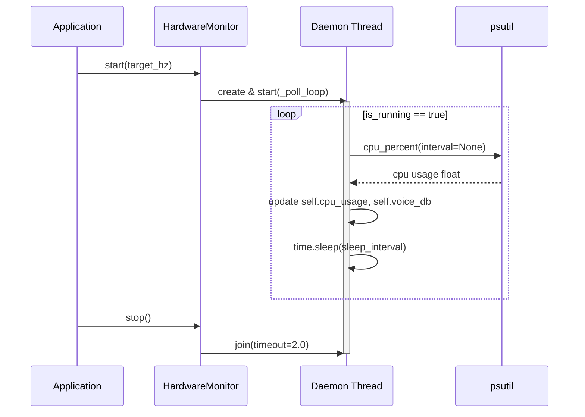

```mermaid
sequenceDiagram
    participant App as Application
    participant HM as HardwareMonitor
    participant Thread as Daemon Thread
    participant PS as psutil

    App->>HM: start(target_hz)
    HM->>Thread: create & start(_poll_loop)
    activate Thread
    loop is_running == true
        Thread->>PS: cpu_percent(interval=None)
        PS-->>Thread: cpu usage float
        Thread->>Thread: update self.cpu_usage, self.voice_db
        Thread->>Thread: time.sleep(sleep_interval)
    end
    App->>HM: stop()
    HM->>Thread: join(timeout=2.0)
    deactivate Thread
```
