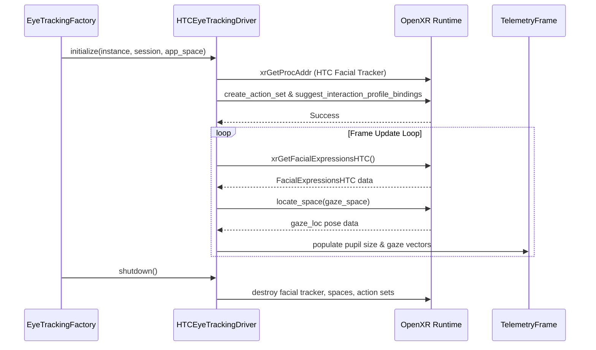

```mermaid
sequenceDiagram
    participant Factory as EyeTrackingFactory
    participant Driver as HTCEyeTrackingDriver
    participant OpenXR as OpenXR Runtime
    participant Frame as TelemetryFrame

    Factory->>Driver: initialize(instance, session, app_space)
    Driver->>OpenXR: xrGetProcAddr (HTC Facial Tracker)
    Driver->>OpenXR: create_action_set & suggest_interaction_profile_bindings
    OpenXR-->>Driver: Success

    loop Frame Update Loop
        Driver->>OpenXR: xrGetFacialExpressionsHTC()
        OpenXR-->>Driver: FacialExpressionsHTC data
        Driver->>OpenXR: locate_space(gaze_space)
        OpenXR-->>Driver: gaze_loc pose data
        Driver->>Frame: populate pupil size & gaze vectors
    end

    Factory->>Driver: shutdown()
    Driver->>OpenXR: destroy facial tracker, spaces, action sets
```
