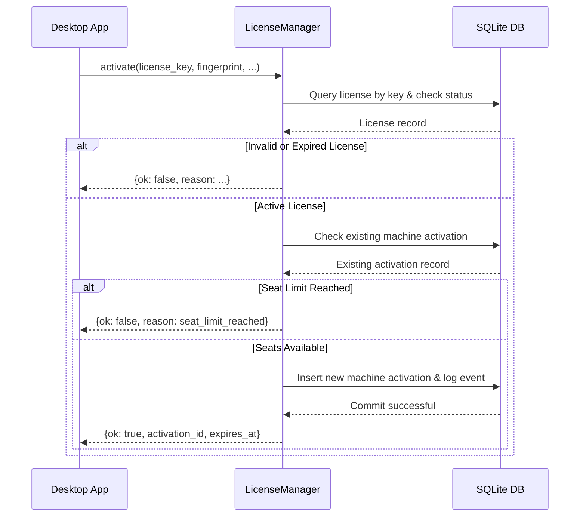

```mermaid
sequenceDiagram
    participant Client as Desktop App
    participant LM as LicenseManager
    participant DB as SQLite DB

    Client->>LM: activate(license_key, fingerprint, ...)
    LM->>DB: Query license by key & check status
    DB-->>LM: License record
    alt Invalid or Expired License
        LM-->>Client: {ok: false, reason: ...}
    else Active License
        LM->>DB: Check existing machine activation
        DB-->>LM: Existing activation record
        alt Seat Limit Reached
            LM-->>Client: {ok: false, reason: seat_limit_reached}
        else Seats Available
            LM->>DB: Insert new machine activation & log event
            DB-->>LM: Commit successful
            LM-->>Client: {ok: true, activation_id, expires_at}
        end
    end
```
