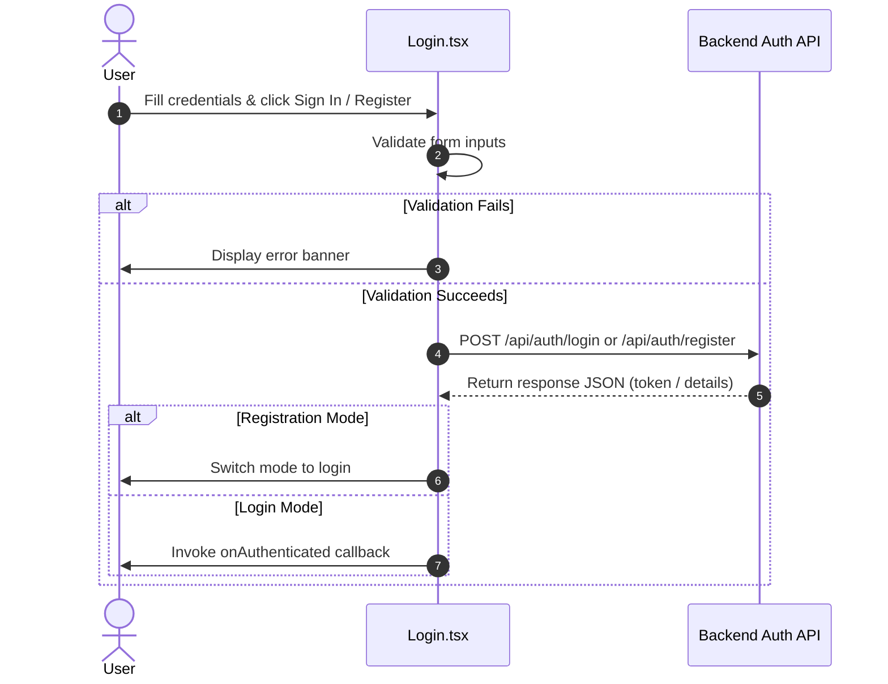

```mermaid
sequenceDiagram
  autonumber
  actor User
  participant Login as Login.tsx
  participant Backend as Backend Auth API
  User->>Login: Fill credentials & click Sign In / Register
  Login->>Login: Validate form inputs
  alt Validation Fails
    Login->>User: Display error banner
  else Validation Succeeds
    Login->>Backend: POST /api/auth/login or /api/auth/register
    Backend-->>Login: Return response JSON (token / details)
    alt Registration Mode
      Login->>User: Switch mode to login
    else Login Mode
      Login->>User: Invoke onAuthenticated callback
    end
  end
```
