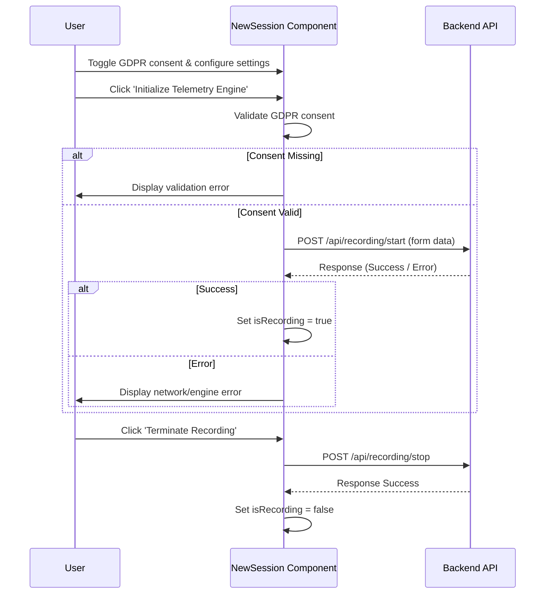

```mermaid
sequenceDiagram
    participant User
    participant UI as NewSession Component
    participant API as Backend API

    User->>UI: Toggle GDPR consent & configure settings
    User->>UI: Click 'Initialize Telemetry Engine'
    UI->>UI: Validate GDPR consent
    alt Consent Missing
        UI->>User: Display validation error
    else Consent Valid
        UI->>API: POST /api/recording/start (form data)
        API-->>UI: Response (Success / Error)
        alt Success
            UI->>UI: Set isRecording = true
        else Error
            UI->>User: Display network/engine error
        end
    end

    User->>UI: Click 'Terminate Recording'
    UI->>API: POST /api/recording/stop
    API-->>UI: Response Success
    UI->>UI: Set isRecording = false
```
