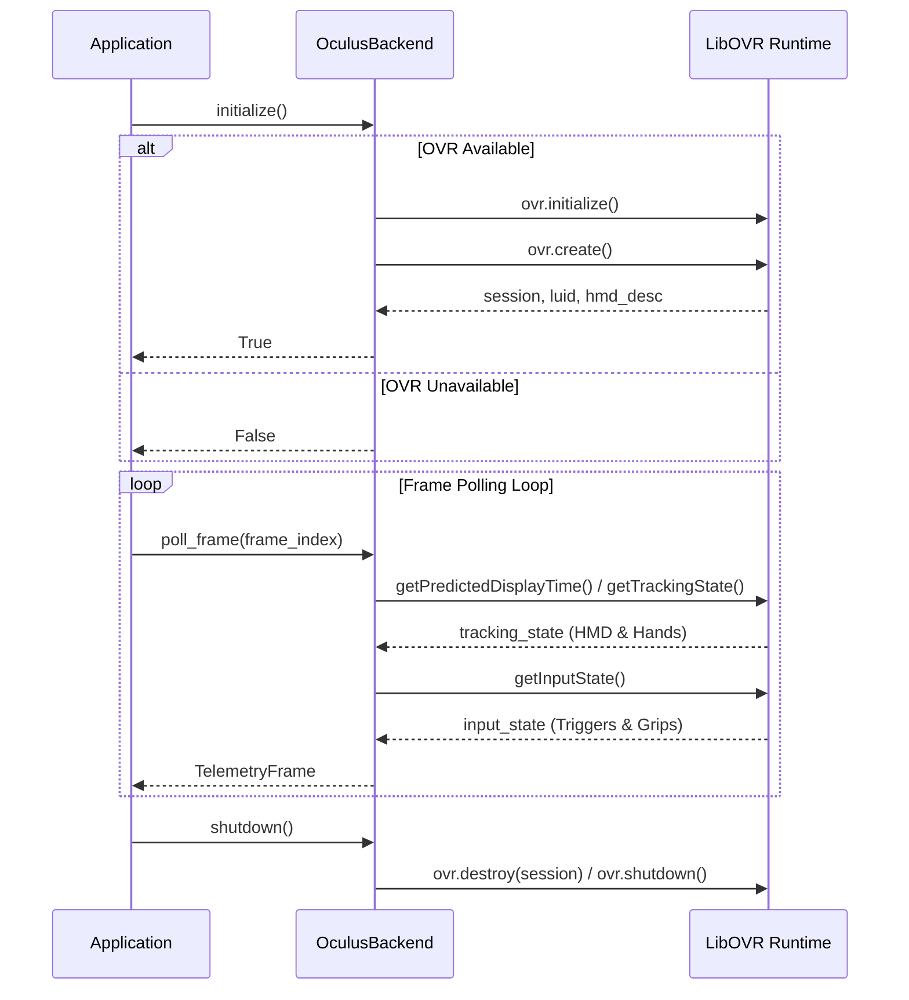

```mermaid
sequenceDiagram
    participant App as Application
    participant Backend as OculusBackend
    participant OVR as LibOVR Runtime

    App->>Backend: initialize()
    alt OVR Available
        Backend->>OVR: ovr.initialize()
        Backend->>OVR: ovr.create()
        OVR-->>Backend: session, luid, hmd_desc
        Backend-->>App: True
    else OVR Unavailable
        Backend-->>App: False
    end

    loop Frame Polling Loop
        App->>Backend: poll_frame(frame_index)
        Backend->>OVR: getPredictedDisplayTime() / getTrackingState()
        OVR-->>Backend: tracking_state (HMD & Hands)
        Backend->>OVR: getInputState()
        OVR-->>Backend: input_state (Triggers & Grips)
        Backend-->>App: TelemetryFrame
    end

    App->>Backend: shutdown()
    Backend->>OVR: ovr.destroy(session) / ovr.shutdown()
```
