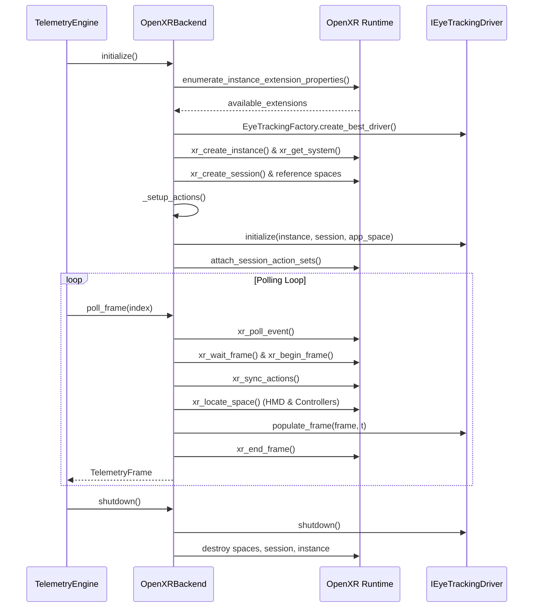

```mermaid
sequenceDiagram
    participant App as TelemetryEngine
    participant Backend as OpenXRBackend
    participant XR as OpenXR Runtime
    participant Eye as IEyeTrackingDriver

    App->>Backend: initialize()
    Backend->>XR: enumerate_instance_extension_properties()
    XR-->>Backend: available_extensions
    Backend->>Eye: EyeTrackingFactory.create_best_driver()
    Backend->>XR: xr_create_instance() & xr_get_system()
    Backend->>XR: xr_create_session() & reference spaces
    Backend->>Backend: _setup_actions()
    Backend->>Eye: initialize(instance, session, app_space)
    Backend->>XR: attach_session_action_sets()
    
    loop Polling Loop
        App->>Backend: poll_frame(index)
        Backend->>XR: xr_poll_event()
        Backend->>XR: xr_wait_frame() & xr_begin_frame()
        Backend->>XR: xr_sync_actions()
        Backend->>XR: xr_locate_space() (HMD & Controllers)
        Backend->>Eye: populate_frame(frame, t)
        Backend->>XR: xr_end_frame()
        Backend-->>App: TelemetryFrame
    end

    App->>Backend: shutdown()
    Backend->>Eye: shutdown()
    Backend->>XR: destroy spaces, session, instance
```
