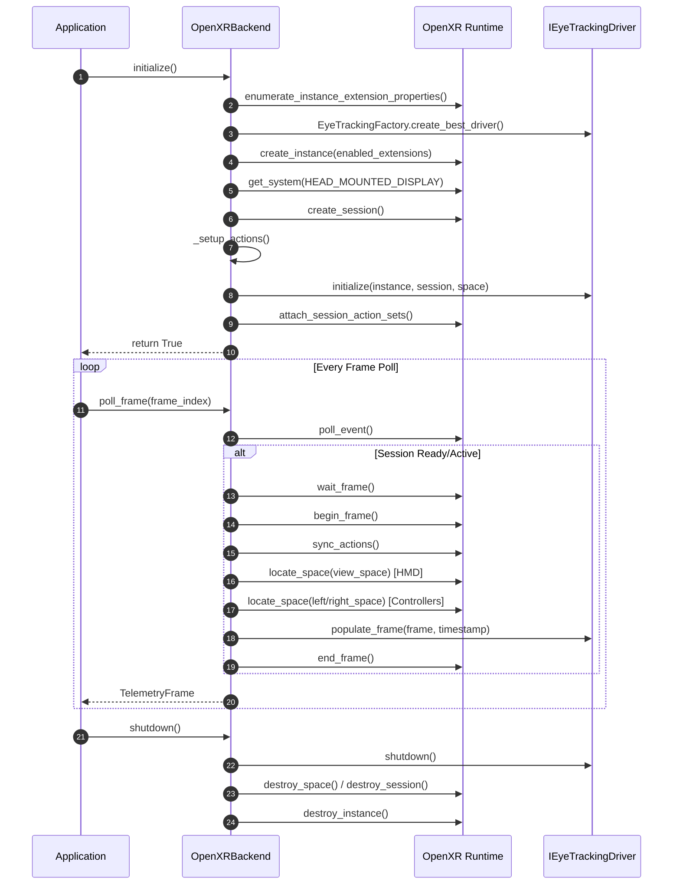

```mermaid
sequenceDiagram
    autonumber
    participant Application
    participant Backend as OpenXRBackend
    participant Runtime as OpenXR Runtime
    participant EyeDriver as IEyeTrackingDriver

    Application->>Backend: initialize()
    Backend->>Runtime: enumerate_instance_extension_properties()
    Backend->>EyeDriver: EyeTrackingFactory.create_best_driver()
    Backend->>Runtime: create_instance(enabled_extensions)
    Backend->>Runtime: get_system(HEAD_MOUNTED_DISPLAY)
    Backend->>Runtime: create_session()
    Backend->>Backend: _setup_actions()
    Backend->>EyeDriver: initialize(instance, session, space)
    Backend->>Runtime: attach_session_action_sets()
    Backend-->>Application: return True

    loop Every Frame Poll
        Application->>Backend: poll_frame(frame_index)
        Backend->>Runtime: poll_event()
        alt Session Ready/Active
            Backend->>Runtime: wait_frame()
            Backend->>Runtime: begin_frame()
            Backend->>Runtime: sync_actions()
            Backend->>Runtime: locate_space(view_space) [HMD]
            Backend->>Runtime: locate_space(left/right_space) [Controllers]
            Backend->>EyeDriver: populate_frame(frame, timestamp)
            Backend->>Runtime: end_frame()
        end
        Backend-->>Application: TelemetryFrame
    end

    Application->>Backend: shutdown()
    Backend->>EyeDriver: shutdown()
    Backend->>Runtime: destroy_space() / destroy_session()
    Backend->>Runtime: destroy_instance()
```