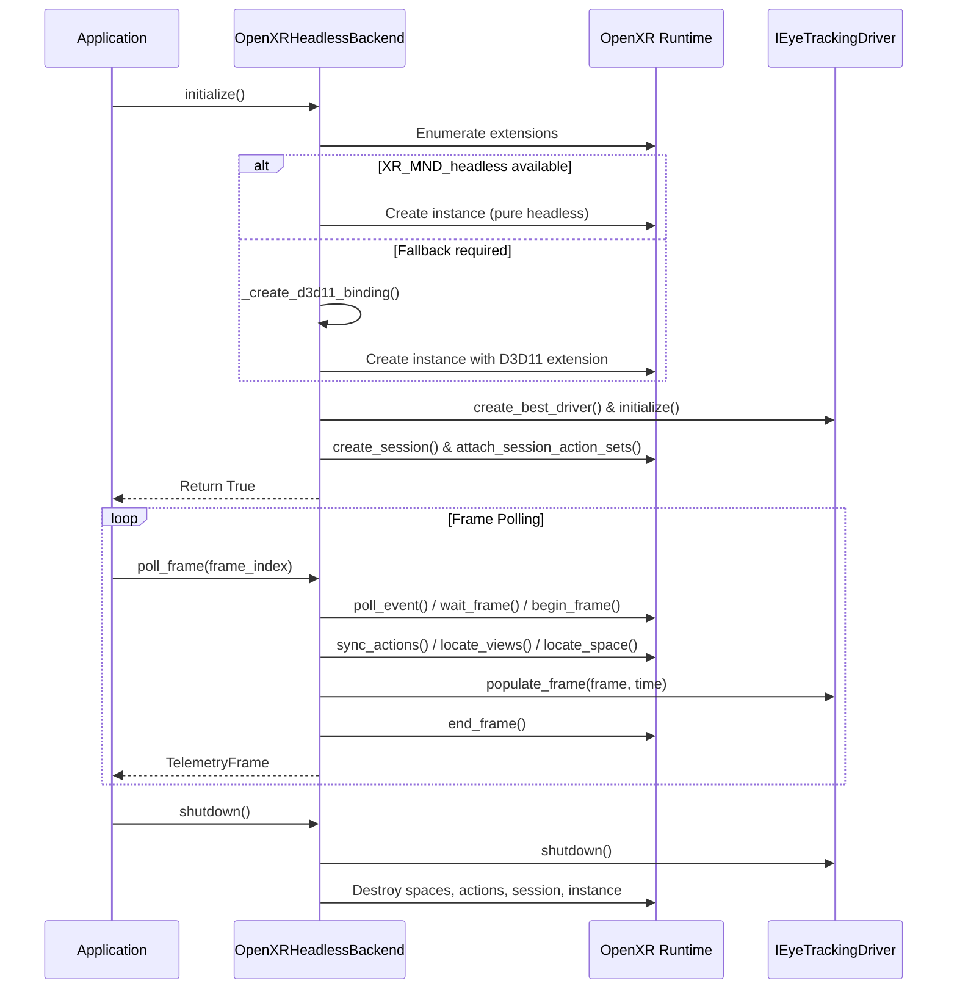

```mermaid
sequenceDiagram
    participant App as Application
    participant Backend as OpenXRHeadlessBackend
    participant XR as OpenXR Runtime
    participant Eye as IEyeTrackingDriver

    App->>Backend: initialize()
    Backend->>XR: Enumerate extensions
    alt XR_MND_headless available
        Backend->>XR: Create instance (pure headless)
    else Fallback required
        Backend->>Backend: _create_d3d11_binding()
        Backend->>XR: Create instance with D3D11 extension
    end
    Backend->>Eye: create_best_driver() & initialize()
    Backend->>XR: create_session() & attach_session_action_sets()
    Backend-->>App: Return True

    loop Frame Polling
        App->>Backend: poll_frame(frame_index)
        Backend->>XR: poll_event() / wait_frame() / begin_frame()
        Backend->>XR: sync_actions() / locate_views() / locate_space()
        Backend->>Eye: populate_frame(frame, time)
        Backend->>XR: end_frame()
        Backend-->>App: TelemetryFrame
    end

    App->>Backend: shutdown()
    Backend->>Eye: shutdown()
    Backend->>XR: Destroy spaces, actions, session, instance
```
