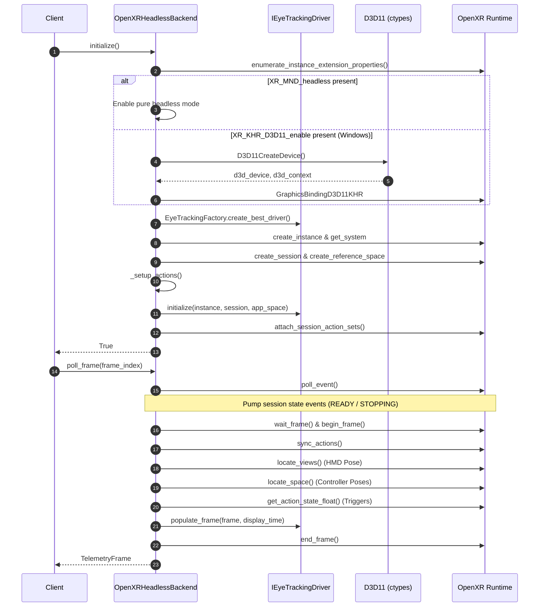

```mermaid
sequenceDiagram
    autonumber
    participant Client
    participant Backend as OpenXRHeadlessBackend
    participant EyeDriver as IEyeTrackingDriver
    participant D3D as D3D11 (ctypes)
    participant OpenXR as OpenXR Runtime

    Client->>Backend: initialize()
    Backend->>OpenXR: enumerate_instance_extension_properties()
    alt XR_MND_headless present
        Backend->>Backend: Enable pure headless mode
    else XR_KHR_D3D11_enable present (Windows)
        Backend->>D3D: D3D11CreateDevice()
        D3D-->>Backend: d3d_device, d3d_context
        Backend->>OpenXR: GraphicsBindingD3D11KHR
    end
    Backend->>EyeDriver: EyeTrackingFactory.create_best_driver()
    Backend->>OpenXR: create_instance & get_system
    Backend->>OpenXR: create_session & create_reference_space
    Backend->>Backend: _setup_actions()
    Backend->>EyeDriver: initialize(instance, session, app_space)
    Backend->>OpenXR: attach_session_action_sets()
    Backend-->>Client: True

    Client->>Backend: poll_frame(frame_index)
    Backend->>OpenXR: poll_event()
    Note over Backend,OpenXR: Pump session state events (READY / STOPPING)
    Backend->>OpenXR: wait_frame() & begin_frame()
    Backend->>OpenXR: sync_actions()
    Backend->>OpenXR: locate_views() (HMD Pose)
    Backend->>OpenXR: locate_space() (Controller Poses)
    Backend->>OpenXR: get_action_state_float() (Triggers)
    Backend->>EyeDriver: populate_frame(frame, display_time)
    Backend->>OpenXR: end_frame()
    Backend-->>Client: TelemetryFrame
```