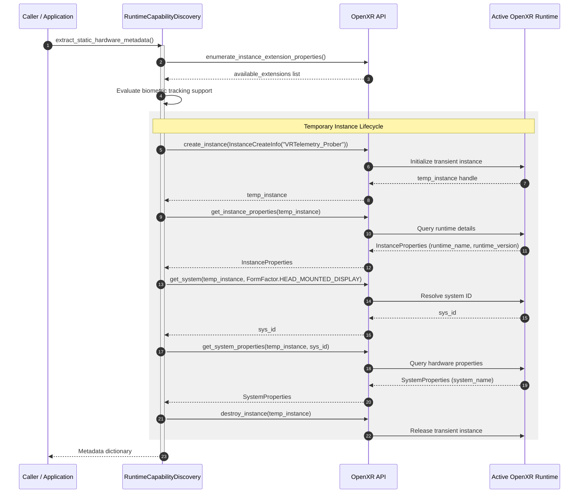

```mermaid
sequenceDiagram
    autonumber
    participant Client as Caller / Application
    participant RCD as RuntimeCapabilityDiscovery
    participant XR as OpenXR API
    participant Runtime as Active OpenXR Runtime

    Client->>RCD: extract_static_hardware_metadata()
    activate RCD
    RCD->>XR: enumerate_instance_extension_properties()
    XR-->>RCD: available_extensions list
    RCD->>RCD: Evaluate biometric tracking support
    
    rect rgb(240, 240, 240)
        note over RCD, Runtime: Temporary Instance Lifecycle
        RCD->>XR: create_instance(InstanceCreateInfo("VRTelemetry_Prober"))
        XR->>Runtime: Initialize transient instance
        Runtime-->>XR: temp_instance handle
        XR-->>RCD: temp_instance

        RCD->>XR: get_instance_properties(temp_instance)
        XR->>Runtime: Query runtime details
        Runtime-->>XR: InstanceProperties (runtime_name, runtime_version)
        XR-->>RCD: InstanceProperties

        RCD->>XR: get_system(temp_instance, FormFactor.HEAD_MOUNTED_DISPLAY)
        XR->>Runtime: Resolve system ID
        Runtime-->>XR: sys_id
        XR-->>RCD: sys_id

        RCD->>XR: get_system_properties(temp_instance, sys_id)
        XR->>Runtime: Query hardware properties
        Runtime-->>XR: SystemProperties (system_name)
        XR-->>RCD: SystemProperties

        RCD->>XR: destroy_instance(temp_instance)
        XR->>Runtime: Release transient instance
    end

    RCD-->>Client: Metadata dictionary
    deactivate RCD
```