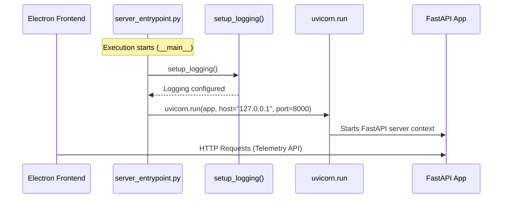

```mermaid
sequenceDiagram
    participant Electron as Electron Frontend
    participant Entry as server_entrypoint.py
    participant Log as setup_logging()
    participant Uvicorn as uvicorn.run
    participant App as FastAPI App

    Note over Entry: Execution starts (__main__)
    Entry->>Log: setup_logging()
    Log-->>Entry: Logging configured
    Entry->>Uvicorn: uvicorn.run(app, host="127.0.0.1", port=8000)
    Uvicorn->>App: Starts FastAPI server context
    Electron->>App: HTTP Requests (Telemetry API)
```