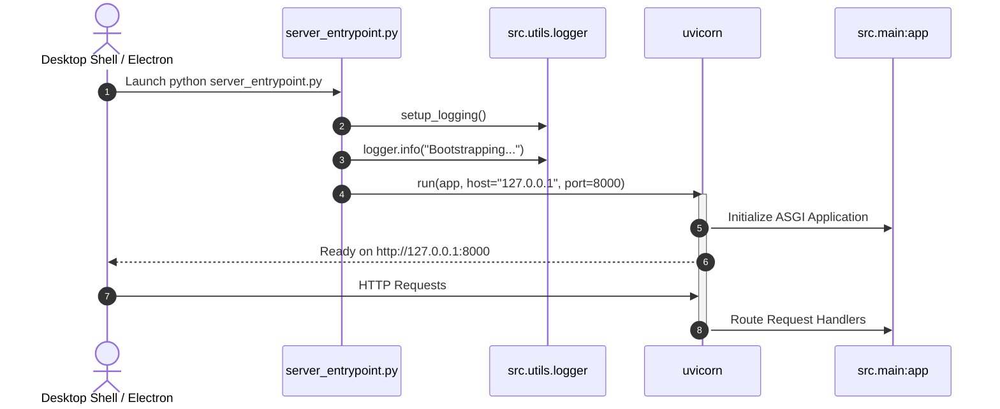

```mermaid
sequenceDiagram
    autonumber
    actor DesktopShell as Desktop Shell / Electron
    participant Entrypoint as server_entrypoint.py
    participant Logger as src.utils.logger
    participant Uvicorn as uvicorn
    participant FastAPI as src.main:app

    DesktopShell->>Entrypoint: Launch python server_entrypoint.py
    Entrypoint->>Logger: setup_logging()
    Entrypoint->>Logger: logger.info("Bootstrapping...")
    Entrypoint->>Uvicorn: run(app, host="127.0.0.1", port=8000)
    activate Uvicorn
    Uvicorn->>FastAPI: Initialize ASGI Application
    Uvicorn-->>DesktopShell: Ready on http://127.0.0.1:8000
    DesktopShell->>Uvicorn: HTTP Requests
    Uvicorn->>FastAPI: Route Request Handlers
    deactivate Uvicorn
```