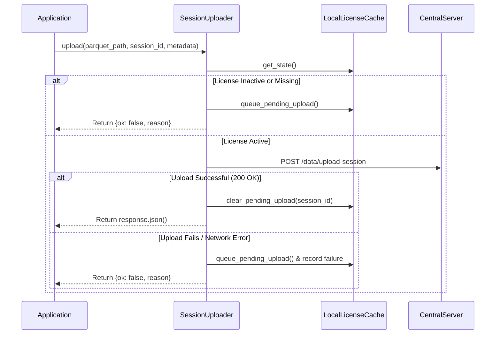

```mermaid
sequenceDiagram
    participant App as Application
    participant SU as SessionUploader
    participant LLC as LocalLicenseCache
    participant CS as CentralServer

    App->>SU: upload(parquet_path, session_id, metadata)
    SU->>LLC: get_state()
    alt License Inactive or Missing
        SU->>LLC: queue_pending_upload()
        SU-->>App: Return {ok: false, reason}
    else License Active
        SU->>CS: POST /data/upload-session
        alt Upload Successful (200 OK)
            SU->>LLC: clear_pending_upload(session_id)
            SU-->>App: Return response.json()
        else Upload Fails / Network Error
            SU->>LLC: queue_pending_upload() & record failure
            SU-->>App: Return {ok: false, reason}
        end
    end
```
