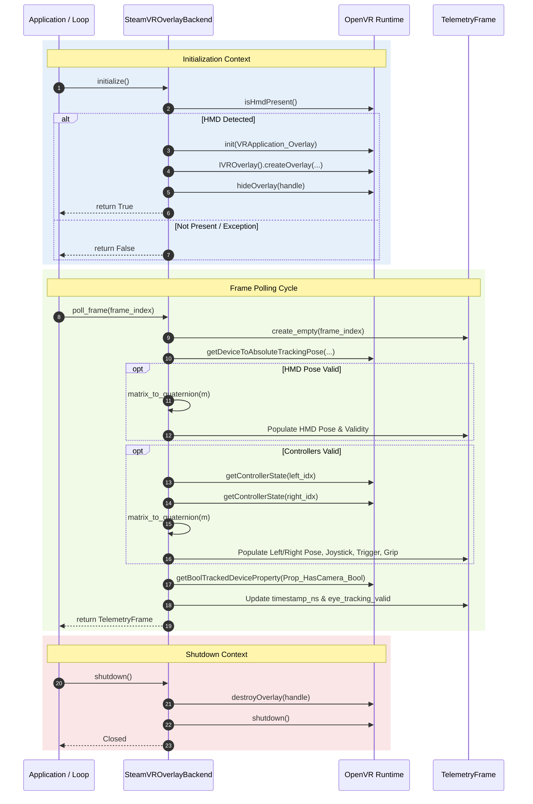

```mermaid
sequenceDiagram
    autonumber
    participant App as Application / Loop
    participant Backend as SteamVROverlayBackend
    participant OpenVR as OpenVR Runtime
    participant TF as TelemetryFrame

    rect rgb(230, 240, 250)
        note over App, OpenVR: Initialization Context
        App->>Backend: initialize()
        Backend->>OpenVR: isHmdPresent()
        alt HMD Detected
            Backend->>OpenVR: init(VRApplication_Overlay)
            Backend->>OpenVR: IVROverlay().createOverlay(...)
            Backend->>OpenVR: hideOverlay(handle)
            Backend-->>App: return True
        else Not Present / Exception
            Backend-->>App: return False
        end
    end

    rect rgb(240, 250, 230)
        note over App, TF: Frame Polling Cycle
        App->>Backend: poll_frame(frame_index)
        Backend->>TF: create_empty(frame_index)
        Backend->>OpenVR: getDeviceToAbsoluteTrackingPose(...)
        
        opt HMD Pose Valid
            Backend->>Backend: matrix_to_quaternion(m)
            Backend->>TF: Populate HMD Pose & Validity
        end

        opt Controllers Valid
            Backend->>OpenVR: getControllerState(left_idx)
            Backend->>OpenVR: getControllerState(right_idx)
            Backend->>Backend: matrix_to_quaternion(m)
            Backend->>TF: Populate Left/Right Pose, Joystick, Trigger, Grip
        end

        Backend->>OpenVR: getBoolTrackedDeviceProperty(Prop_HasCamera_Bool)
        Backend->>TF: Update timestamp_ns & eye_tracking_valid
        Backend-->>App: return TelemetryFrame
    end

    rect rgb(250, 230, 230)
        note over App, OpenVR: Shutdown Context
        App->>Backend: shutdown()
        Backend->>OpenVR: destroyOverlay(handle)
        Backend->>OpenVR: shutdown()
        Backend-->>App: Closed
    end
```