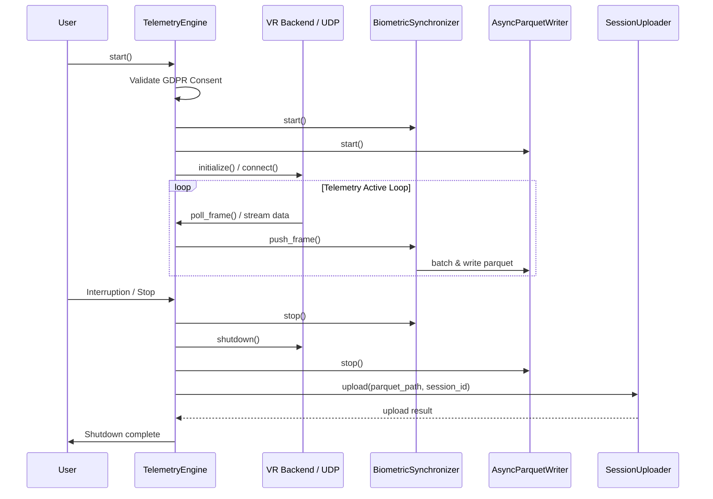

```mermaid
sequenceDiagram
    participant User
    participant Engine as TelemetryEngine
    participant Backend as VR Backend / UDP
    participant Sync as BiometricSynchronizer
    participant Writer as AsyncParquetWriter
    participant Uploader as SessionUploader

    User->>Engine: start()
    Engine->>Engine: Validate GDPR Consent
    Engine->>Sync: start()
    Engine->>Writer: start()
    Engine->>Backend: initialize() / connect()
    
    loop Telemetry Active Loop
        Backend->>Engine: poll_frame() / stream data
        Engine->>Sync: push_frame()
        Sync->>Writer: batch & write parquet
    end

    User->>Engine: Interruption / Stop
    Engine->>Sync: stop()
    Engine->>Backend: shutdown()
    Engine->>Writer: stop()
    Engine->>Uploader: upload(parquet_path, session_id)
    Uploader-->>Engine: upload result
    Engine->>User: Shutdown complete
```