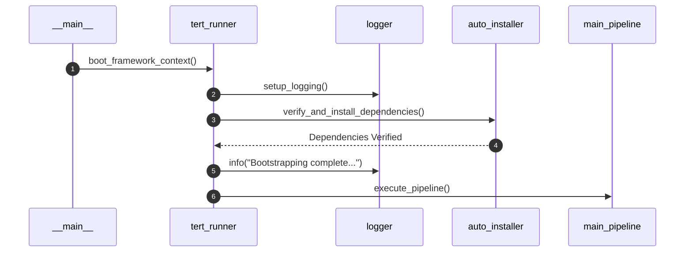

```mermaid
sequenceDiagram
    autonumber
    participant Main as __main__
    participant Runner as tert_runner
    participant Logger as logger
    participant Installer as auto_installer
    participant Pipeline as main_pipeline

    Main->>Runner: boot_framework_context()
    Runner->>Logger: setup_logging()
    Runner->>Installer: verify_and_install_dependencies()
    Installer-->>Runner: Dependencies Verified
    Runner->>Logger: info("Bootstrapping complete...")
    Runner->>Pipeline: execute_pipeline()
```
