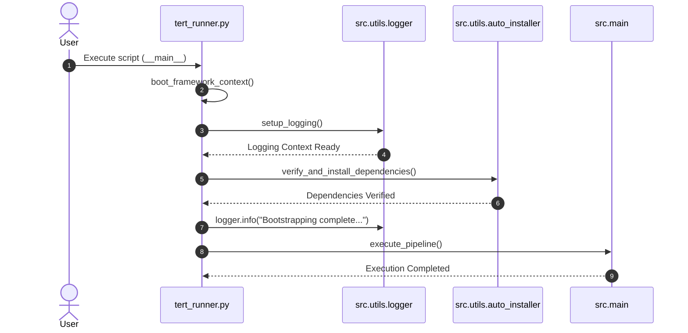

```mermaid
sequenceDiagram
    autonumber
    actor User
    participant Runner as tert_runner.py
    participant Logger as src.utils.logger
    participant Installer as src.utils.auto_installer
    participant Main as src.main

    User->>Runner: Execute script (__main__)
    Runner->>Runner: boot_framework_context()
    Runner->>Logger: setup_logging()
    Logger-->>Runner: Logging Context Ready
    Runner->>Installer: verify_and_install_dependencies()
    Installer-->>Runner: Dependencies Verified
    Runner->>Logger: logger.info("Bootstrapping complete...")
    Runner->>Main: execute_pipeline()
    Main-->>Runner: Execution Completed
```