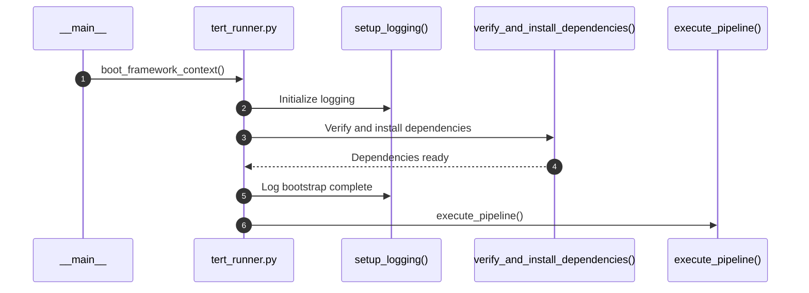

```mermaid
sequenceDiagram
    autonumber
    participant Main as __main__
    participant Runner as tert_runner.py
    participant Logger as setup_logging()
    participant Installer as verify_and_install_dependencies()
    participant Pipeline as execute_pipeline()

    Main->>Runner: boot_framework_context()
    Runner->>Logger: Initialize logging
    Runner->>Installer: Verify and install dependencies
    Installer-->>Runner: Dependencies ready
    Runner->>Logger: Log bootstrap complete
    Runner->>Pipeline: execute_pipeline()
```