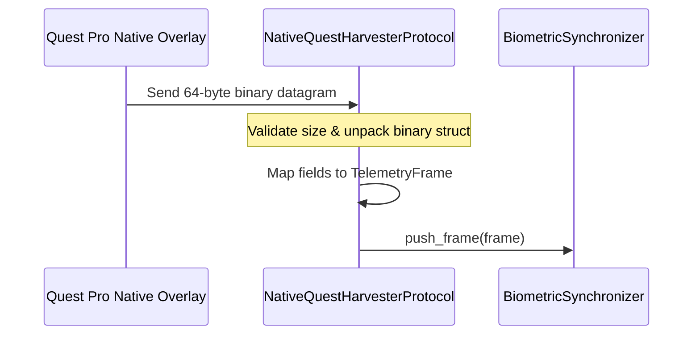

```mermaid
sequenceDiagram
    participant Quest as Quest Pro Native Overlay
    participant Protocol as NativeQuestHarvesterProtocol
    participant Sync as BiometricSynchronizer
    
    Quest->>Protocol: Send 64-byte binary datagram
    Note over Protocol: Validate size & unpack binary struct
    Protocol->>Protocol: Map fields to TelemetryFrame
    Protocol->>Sync: push_frame(frame)
```
