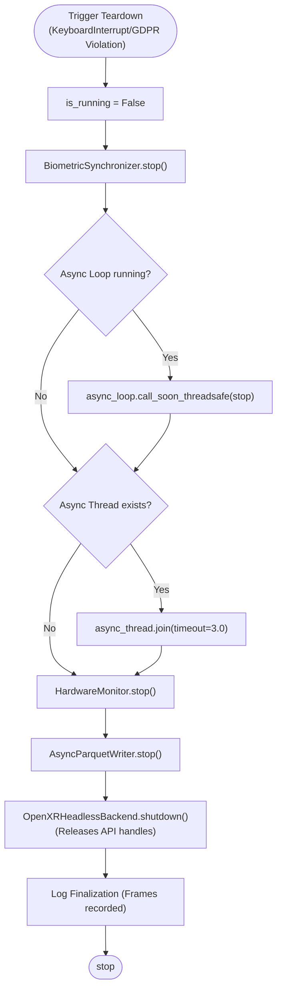

```mermaid
flowchart TD
    Start(["Trigger Teardown<br/>(KeyboardInterrupt/GDPR Violation)"]) --> Flag["is_running = False"]
    Flag --> SyncStop["BiometricSynchronizer.stop()"]
    SyncStop --> CheckAsync{"Async Loop running?"}
    CheckAsync -- Yes --> StopLoop["async_loop.call_soon_threadsafe(stop)"]
    CheckAsync -- No --> CheckThread
    StopLoop --> CheckThread{"Async Thread exists?"}
    CheckThread -- Yes --> Join["async_thread.join(timeout=3.0)"]
    CheckThread -- No --> HWStop
    Join --> HWStop["HardwareMonitor.stop()"]
    HWStop --> WriterStop["AsyncParquetWriter.stop()"]
    WriterStop --> XRStop["OpenXRHeadlessBackend.shutdown()<br/>(Releases API handles)"]
    XRStop --> Log["Log Finalization (Frames recorded)"]
    Log --> Stop(["stop"])
```

