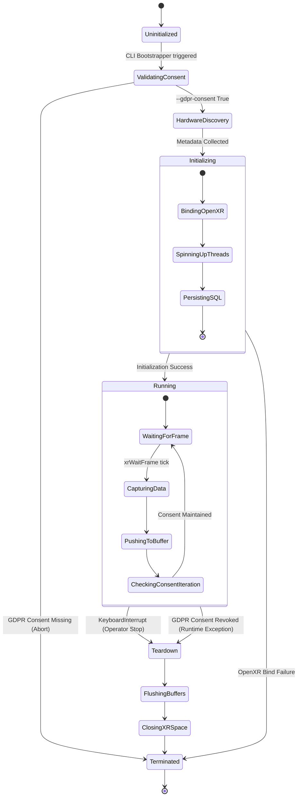

```mermaid
stateDiagram-v2
    [*] --> Uninitialized

    Uninitialized --> ValidatingConsent : CLI Bootstrapper triggered
    ValidatingConsent --> Terminated : GDPR Consent Missing (Abort)
    ValidatingConsent --> HardwareDiscovery : --gdpr-consent True
    
    HardwareDiscovery --> Initializing : Metadata Collected
    
    state Initializing {
        [*] --> BindingOpenXR
        BindingOpenXR --> SpinningUpThreads
        SpinningUpThreads --> PersistingSQL
        PersistingSQL --> [*]
    }
    
    Initializing --> Running : Initialization Success
    Initializing --> Terminated : OpenXR Bind Failure
    
    state Running {
        [*] --> WaitingForFrame
        WaitingForFrame --> CapturingData : xrWaitFrame tick
        CapturingData --> PushingToBuffer
        PushingToBuffer --> CheckingConsentIteration
        CheckingConsentIteration --> WaitingForFrame : Consent Maintained
    }
    
    Running --> Teardown : KeyboardInterrupt (Operator Stop)
    Running --> Teardown : GDPR Consent Revoked (Runtime Exception)
    
    Teardown --> FlushingBuffers
    FlushingBuffers --> ClosingXRSpace
    ClosingXRSpace --> Terminated
    
    Terminated --> [*]
```
