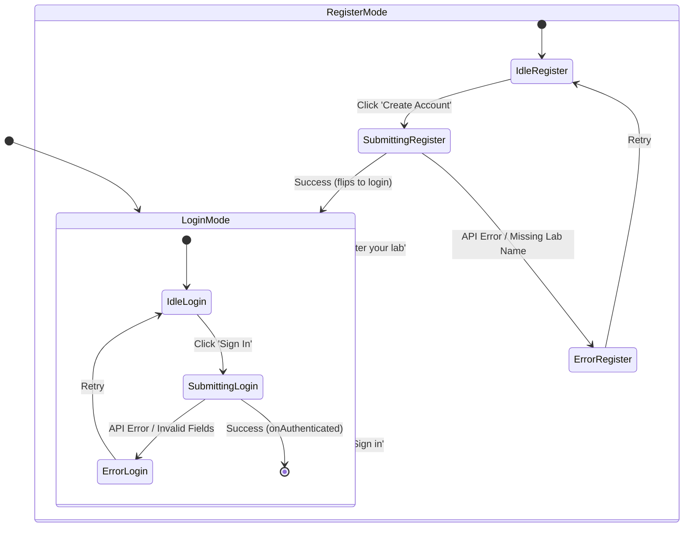

```mermaid
stateDiagram-v2
    [*] --> LoginMode
    state LoginMode {
        [*] --> IdleLogin
        IdleLogin --> SubmittingLogin : Click 'Sign In'
        SubmittingLogin --> ErrorLogin : API Error / Invalid Fields
        ErrorLogin --> IdleLogin : Retry
        SubmittingLogin --> [*] : Success (onAuthenticated)
    }
    LoginMode --> RegisterMode : Click 'Register your lab'
    state RegisterMode {
        [*] --> IdleRegister
        IdleRegister --> SubmittingRegister : Click 'Create Account'
        SubmittingRegister --> ErrorRegister : API Error / Missing Lab Name
        ErrorRegister --> IdleRegister : Retry
        SubmittingRegister --> LoginMode : Success (flips to login)
    }
    RegisterMode --> LoginMode : Click 'Sign in'
```