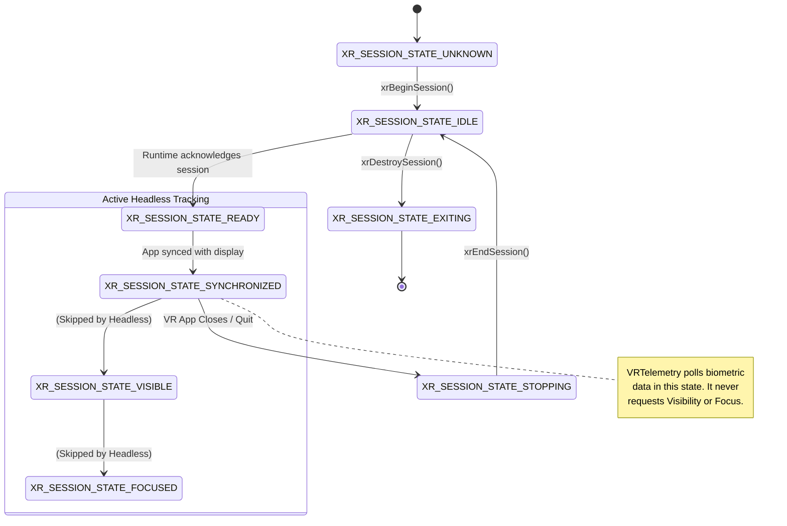

```mermaid
stateDiagram-v2
    [*] --> XR_SESSION_STATE_UNKNOWN
    
    XR_SESSION_STATE_UNKNOWN --> XR_SESSION_STATE_IDLE : xrBeginSession()
    
    XR_SESSION_STATE_IDLE --> XR_SESSION_STATE_READY : Runtime acknowledges session
    
    state "Active Headless Tracking" as ActiveTracking {
        XR_SESSION_STATE_READY --> XR_SESSION_STATE_SYNCHRONIZED : App synced with display
        XR_SESSION_STATE_SYNCHRONIZED --> XR_SESSION_STATE_VISIBLE : (Skipped by Headless)
        XR_SESSION_STATE_VISIBLE --> XR_SESSION_STATE_FOCUSED : (Skipped by Headless)
        
        %% In headless mode, we can pull data while merely synchronized
        note right of XR_SESSION_STATE_SYNCHRONIZED
            VRTelemetry polls biometric 
            data in this state. It never 
            requests Visibility or Focus.
        end note
    }
    
    XR_SESSION_STATE_SYNCHRONIZED --> XR_SESSION_STATE_STOPPING : VR App Closes / Quit
    
    XR_SESSION_STATE_STOPPING --> XR_SESSION_STATE_IDLE : xrEndSession()
    
    XR_SESSION_STATE_IDLE --> XR_SESSION_STATE_EXITING : xrDestroySession()
    
    XR_SESSION_STATE_EXITING --> [*]
```
