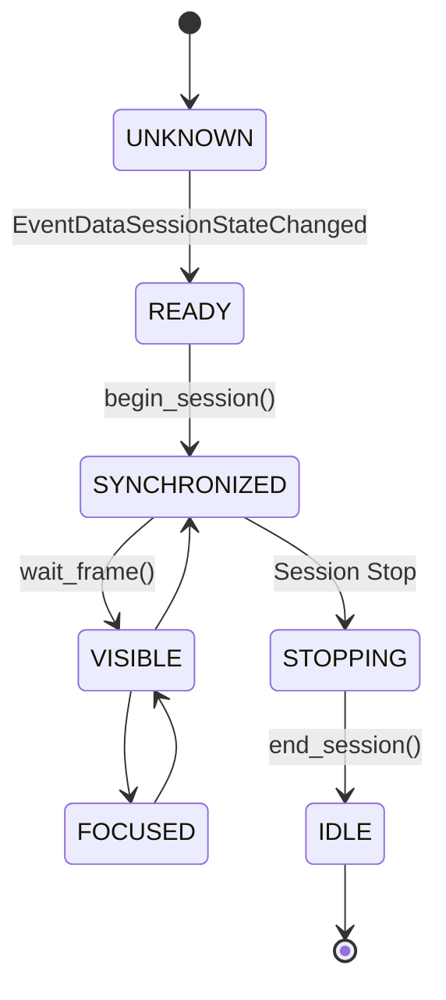

```mermaid
stateDiagram-v2
    [*] --> UNKNOWN
    UNKNOWN --> READY : EventDataSessionStateChanged
    READY --> SYNCHRONIZED : begin_session()
    SYNCHRONIZED --> VISIBLE : wait_frame()
    VISIBLE --> FOCUSED
    FOCUSED --> VISIBLE
    VISIBLE --> SYNCHRONIZED
    SYNCHRONIZED --> STOPPING : Session Stop
    STOPPING --> IDLE : end_session()
    IDLE --> [*]
```