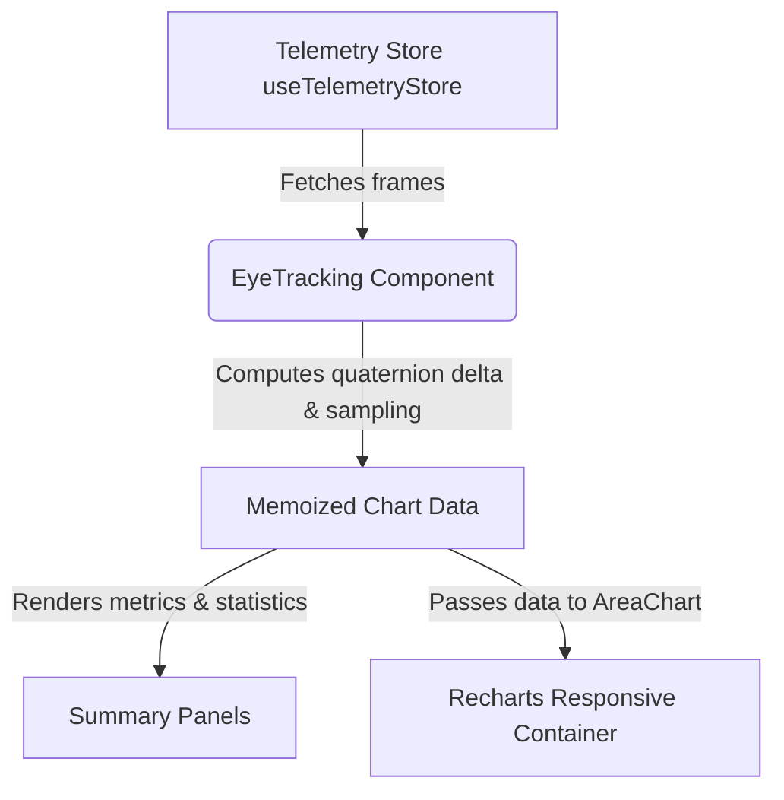

```mermaid
graph TD
    A[Telemetry Store useTelemetryStore] -->|Fetches frames| B(EyeTracking Component)
    B -->|Computes quaternion delta & sampling| C[Memoized Chart Data]
    C -->|Renders metrics & statistics| D[Summary Panels]
    C -->|Passes data to AreaChart| E[Recharts Responsive Container]
```