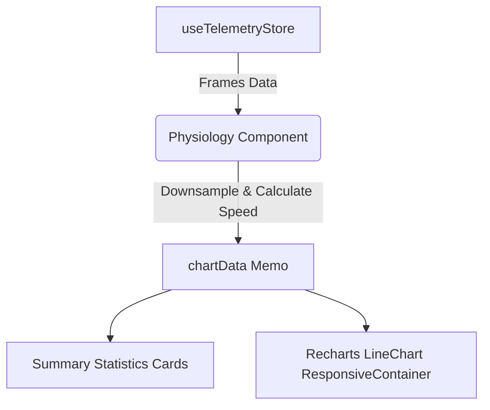

```mermaid
graph TD
    A[useTelemetryStore] -->|Frames Data| B(Physiology Component)
    B -->|Downsample & Calculate Speed| C[chartData Memo]
    C --> D[Summary Statistics Cards]
    C --> E[Recharts LineChart ResponsiveContainer]
```
