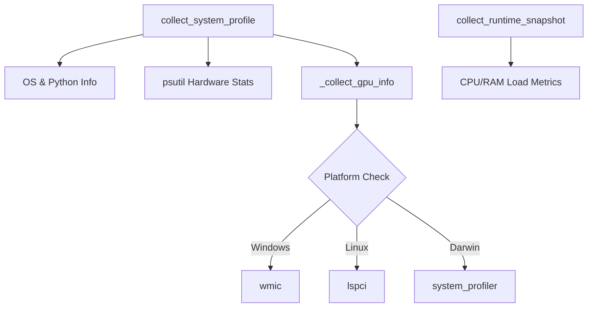

```mermaid
graph TD
    A[collect_system_profile] --> B[OS & Python Info]
    A --> C[psutil Hardware Stats]
    A --> D[_collect_gpu_info]
    D --> E{Platform Check}
    E -->|Windows| F[wmic]
    E -->|Linux| G[lspci]
    E -->|Darwin| H[system_profiler]
    I[collect_runtime_snapshot] --> J[CPU/RAM Load Metrics]
```
