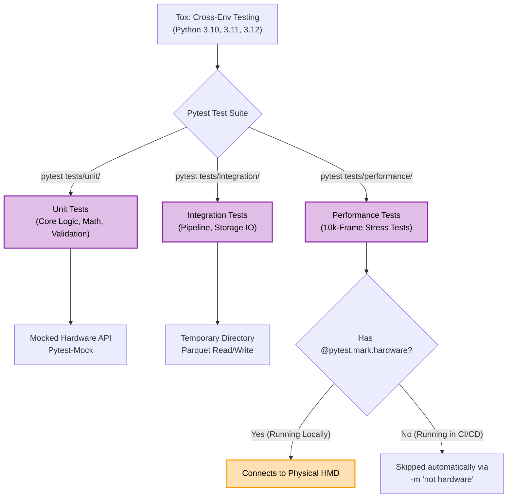

# Testing Architecture


```mermaid
flowchart TD
    Tox["Tox: Cross-Env Testing<br/>(Python 3.10, 3.11, 3.12)"] --> Pytest
    Pytest{"Pytest Test Suite"}
    Pytest -- "pytest tests/unit/" --> Unit["Unit Tests<br/>(Core Logic, Math, Validation)"]
    Pytest -- "pytest tests/integration/" --> Integ["Integration Tests<br/>(Pipeline, Storage IO)"]
    Pytest -- "pytest tests/performance/" --> Perf["Performance Tests<br/>(10k-Frame Stress Tests)"]
    Unit --> Mock["Mocked Hardware API<br/>Pytest-Mock"]
    Integ --> Temp["Temporary Directory<br/>Parquet Read/Write"]
    Perf --> MarkHardware{"Has @pytest.mark.hardware?"}
    MarkHardware -- "Yes (Running Locally)" --> RealHMD["Connects to Physical HMD"]
    MarkHardware -- "No (Running in CI/CD)" --> Skip["Skipped automatically via<br/>-m 'not hardware'"]
    classDef test fill:#e1bee7,stroke:#8e24aa,stroke-width:2px,color:#000;
    classDef hardware fill:#ffe0b2,stroke:#ff9800,stroke-width:2px,color:#000;
    class Unit,Integ,Perf test;
    class RealHMD hardware;
```

---

## Folder & File Structure

Here is the layout of files and subfolders contained within this path:

```text
testing/
├── README.md
└── testing_architecture.svg
```