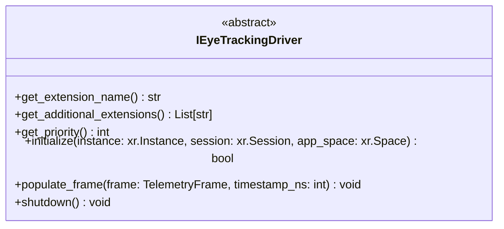

```mermaid
classDiagram
    class IEyeTrackingDriver {
        <<abstract>>
        +get_extension_name() str
        +get_additional_extensions() List[str]
        +get_priority() int
        +initialize(instance: xr.Instance, session: xr.Session, app_space: xr.Space) bool
        +populate_frame(frame: TelemetryFrame, timestamp_ns: int) void
        +shutdown() void
    }
```