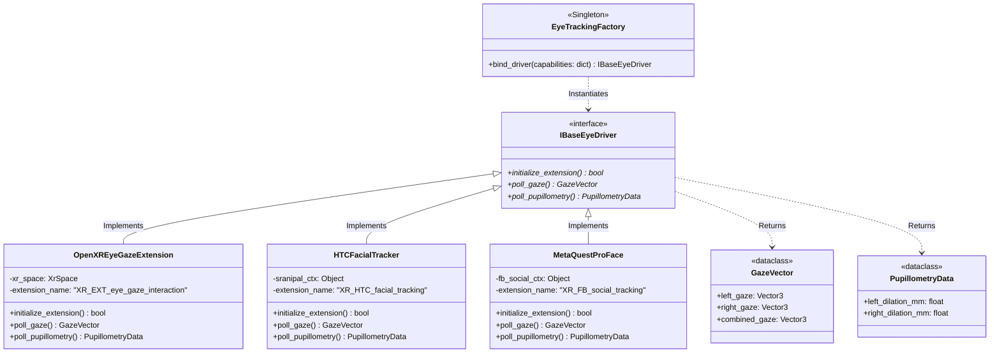

```mermaid
classDiagram
    class EyeTrackingFactory {
        <<Singleton>>
        +bind_driver(capabilities: dict) IBaseEyeDriver
    }

    class IBaseEyeDriver {
        <<interface>>
        +initialize_extension() bool*
        +poll_gaze() GazeVector*
        +poll_pupillometry() PupillometryData*
    }

    class OpenXREyeGazeExtension {
        -xr_space: XrSpace
        -extension_name: "XR_EXT_eye_gaze_interaction"
        +initialize_extension() bool
        +poll_gaze() GazeVector
        +poll_pupillometry() PupillometryData
    }

    class HTCFacialTracker {
        -sranipal_ctx: Object
        -extension_name: "XR_HTC_facial_tracking"
        +initialize_extension() bool
        +poll_gaze() GazeVector
        +poll_pupillometry() PupillometryData
    }

    class MetaQuestProFace {
        -fb_social_ctx: Object
        -extension_name: "XR_FB_social_tracking"
        +initialize_extension() bool
        +poll_gaze() GazeVector
        +poll_pupillometry() PupillometryData
    }

    class GazeVector {
        <<dataclass>>
        +left_gaze: Vector3
        +right_gaze: Vector3
        +combined_gaze: Vector3
    }
    
    class PupillometryData {
        <<dataclass>>
        +left_dilation_mm: float
        +right_dilation_mm: float
    }

    EyeTrackingFactory ..> IBaseEyeDriver : Instantiates
    IBaseEyeDriver <|-- OpenXREyeGazeExtension : Implements
    IBaseEyeDriver <|-- HTCFacialTracker : Implements
    IBaseEyeDriver <|-- MetaQuestProFace : Implements
    IBaseEyeDriver ..> GazeVector : Returns
    IBaseEyeDriver ..> PupillometryData : Returns
```
