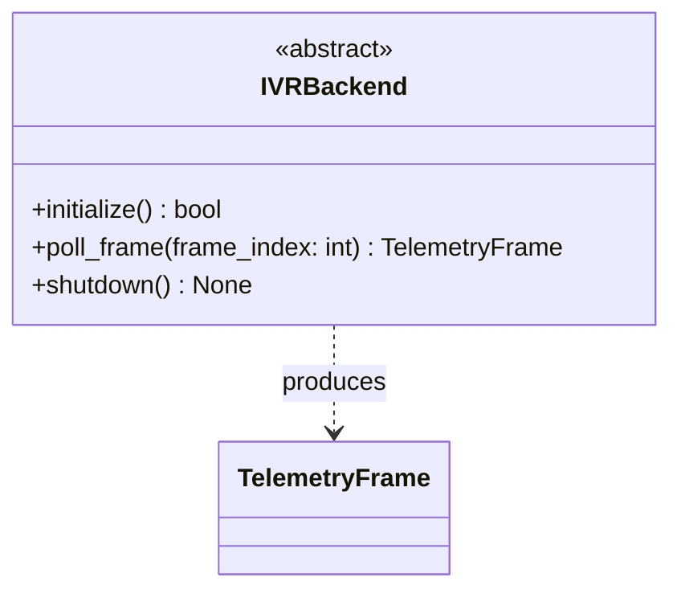

```mermaid
classDiagram
    class IVRBackend {
        <<abstract>>
        +initialize() bool
        +poll_frame(frame_index: int) TelemetryFrame
        +shutdown() None
    }
    class TelemetryFrame {
    }
    IVRBackend ..> TelemetryFrame : produces
```
